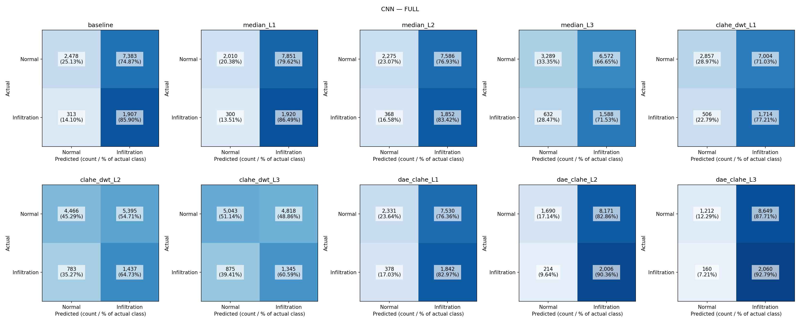

# Notebook 2 — CNN / Grad-CAM / SHAP

ผลในหน้านี้สร้างจากไฟล์ที่ประเมินจริง ช่องว่างหมายถึงยังไม่ได้รัน ไม่ใช่คะแนนศูนย์

คู่มือเตรียม Google Drive และเปิด Colab: [RUN_GUIDE.md](RUN_GUIDE.md)

Run mode: **full**; seed: **42**. ผล smoke ใช้ตรวจการทำงานเท่านั้น ไม่ใช่ผลวิจัย

Train **160 ภาพ/คลาส**; validation **40 ภาพ/คลาส**. ผลรอบหลักเก็บใต้ `runs/pilot320_val80_test100/` ของโฟลเดอร์ Notebook_2

ฝึก epoch ละ **320 ภาพรวม**; test **100 ภาพ** (official_balanced_subset). ผล test subset ไม่ใช่ผลประเมิน official test เต็ม

อัปโหลด Notebook_2_colab.zip ไฟล์เดียวไป MyDrive/ แล้วเปิด notebook รุ่นใหม่ ชุดนี้มีเฉพาะภาพที่ใช้จริง; XAI เก็บต้นฉบับ ส่วน classification เก็บ working pixels 256×256 แบบ lossless

## โครงสร้างและลำดับรัน

1. CNN/cnn_comparison.ipynb: ตรวจข้อมูล ฝึก DAE และ CNN ทั้ง 10 เงื่อนไข บันทึก checkpoint
2. Grad-CAM/gradcam_comparison.ipynb: โหลด CNN ของแต่ละเงื่อนไขและประเมิน bbox
3. SHAP/shap_comparison.ipynb: โหลด CNN เดียวกัน เก็บ signed attribution และประเมินเฉพาะค่าบวก

shared/config.json เป็นค่าตั้งกลาง; shared/artifacts/manifests เป็นรายชื่อข้อมูลร่วม; แต่ละเกณฑ์เก็บผลรายเงื่อนไขใน results/ และผลเปรียบเทียบใน comparison/

## CNN

| condition_id | status | n | accuracy | precision | recall | f1 | roc_auc |
| --- | --- | --- | --- | --- | --- | --- | --- |
| baseline | not_run | — | — | — | — | — | — |
| median_L1 | not_run | — | — | — | — | — | — |
| median_L2 | not_run | — | — | — | — | — | — |
| median_L3 | not_run | — | — | — | — | — | — |
| clahe_dwt_L1 | not_run | — | — | — | — | — | — |
| clahe_dwt_L2 | not_run | — | — | — | — | — | — |
| clahe_dwt_L3 | not_run | — | — | — | — | — | — |
| dae_clahe_L1 | not_run | — | — | — | — | — | — |
| dae_clahe_L2 | not_run | — | — | — | — | — | — |
| dae_clahe_L3 | not_run | — | — | — | — | — | — |

## Grad-CAM

ยังไม่มีผลที่ประเมินจริง

## SHAP

ยังไม่มีผลที่ประเมินจริง

## ความครบถ้วน

| condition_id | CNN | Grad-CAM | SHAP |
| --- | --- | --- | --- |
| baseline | not_run | not_run | not_run |
| median_L1 | not_run | not_run | not_run |
| median_L2 | not_run | not_run | not_run |
| median_L3 | not_run | not_run | not_run |
| clahe_dwt_L1 | not_run | not_run | not_run |
| clahe_dwt_L2 | not_run | not_run | not_run |
| clahe_dwt_L3 | not_run | not_run | not_run |
| dae_clahe_L1 | not_run | not_run | not_run |
| dae_clahe_L2 | not_run | not_run | not_run |
| dae_clahe_L3 | not_run | not_run | not_run |

## วิธีตีความ

Classification: Infiltration-only vs No Finding-only บน official test ที่กรองแล้วทั้งหมด XAI: bbox 123 ภาพ รวม mixed cases จึงเป็นคนละประชากรกับ classification test

XAI แสดง Overall และแยก Pure / Mixed-high-risk / Mixed-low-risk ใน CSV CI สุ่มคนไข้ ไม่สุ่มภาพแยกกัน; heatmap ศูนย์นับ IoU=0 และ Pointing Game=Miss

CLAHE+DWT ใช้ db1 และ DWT→CLAHE โดย clip/depth/threshold เปลี่ยนร่วมกัน จึงตีความเป็น joint presets DAE+CLAHE L1–L3 เปลี่ยน contrast หลัง DAE ไม่ใช่ความแรงของ DAE

ข้อมูล checkpoint และ manifest hashes อยู่ในไฟล์ผลเพื่อป้องกันผลต่างการทดลองปะปนกัน label NIH มาจาก NLP และ bounding box เป็นกรอบคร่าว ๆ ไม่ใช่ lesion segmentation
