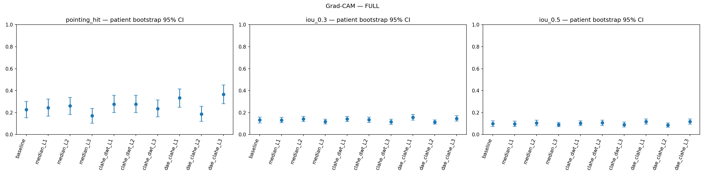

# ผล Grad-CAM — Notebook v2 release

ประเมินครบ 10 เงื่อนไข × 123 ภาพ / 115 คนไข้ ใช้ผลรายภาพ 1,230 แถว ค่าในวงเล็บเป็น 95% CI

| เงื่อนไข | Pointing Game (95% CI) | Energy inside (95% CI) | IoU@0.3 (95% CI) | IoU@0.5 (95% CI) |
| --- | --- | --- | --- | --- |
| Baseline | 22.76% (15.20–30.08) | 16.08% (13.02–19.17) | 0.1321 (0.1060–0.1577) | 0.0983 (0.0736–0.1236) |
| Median L1 | 24.39% (16.67–32.26) | 16.78% (13.60–20.06) | 0.1314 (0.1070–0.1559) | 0.0970 (0.0725–0.1215) |
| Median L2 | 26.02% (18.18–33.89) | 17.52% (14.24–20.93) | 0.1405 (0.1175–0.1645) | 0.1049 (0.0805–0.1302) |
| Median L3 | 17.07% (10.40–23.81) | 14.92% (12.17–17.66) | 0.1182 (0.0968–0.1399) | 0.0902 (0.0703–0.1100) |
| CLAHE+DWT L1 | 27.64% (19.85–35.77) | 16.78% (13.92–19.77) | 0.1416 (0.1186–0.1647) | 0.1034 (0.0826–0.1245) |
| CLAHE+DWT L2 | 27.64% (19.83–35.71) | 17.17% (13.88–20.71) | 0.1344 (0.1090–0.1595) | 0.1068 (0.0814–0.1314) |
| CLAHE+DWT L3 | 23.58% (16.13–31.41) | 15.51% (12.49–18.76) | 0.1151 (0.0929–0.1393) | 0.0903 (0.0689–0.1137) |
| DAE+CLAHE L1 | 33.33% (24.79–41.46) | 18.69% (15.48–22.09) | 0.1558 (0.1315–0.1814) | 0.1171 (0.0945–0.1405) |
| DAE+CLAHE L2 | 18.70% (12.00–25.60) | 15.01% (12.38–17.89) | 0.1143 (0.0949–0.1333) | 0.0851 (0.0661–0.1046) |
| DAE+CLAHE L3 | 36.59% (27.96–45.24) | 20.05% (16.56–23.83) | 0.1465 (0.1217–0.1714) | 0.1177 (0.0945–0.1413) |

**DAE+CLAHE L3 มี Pointing Game สูงสุด 36.59% (45/123 ภาพ)** เทียบ baseline 22.76% (28/123 ภาพ) เพิ่ม 13.82 จุดเปอร์เซ็นต์ และมี Energy inside สูงสุด 20.05% รวมถึง IoU@0.5 สูงสุด 0.1177

**DAE+CLAHE L1 มี IoU@0.3 สูงสุด 0.1558** เทียบ baseline 0.1321 จึงอาจให้การทับซ้อนของพื้นที่ดีกว่า L3 ที่ threshold นี้ แม้ L3 ชี้จุดสูงสุดได้ถูกมากกว่า

Median L2 ดีกว่า baseline ในภาพรวม แต่ Median L3 ลดลง ส่วน CLAHE+DWT L1/L2 ให้ผลดีกว่า L3 หลายตัวชี้วัด เป็นแนวโน้มที่ควรศึกษาต่อเรื่องการสูญเสียรายละเอียด ไม่ใช่หลักฐานยืนยันสาเหตุ over-smoothing

DAE+CLAHE L2 ต่ำกว่า baseline ทุกตัวชี้วัด Grad-CAM ในภาพรวม ขณะที่ L1 และ L3 สูงกว่า จึงไม่ควรสรุปว่าปรับระดับแรงขึ้นแล้วผลจะดีขึ้นหรือลดลงต่อเนื่อง

## ความหมายของคะแนน

- **Pointing Game:** จุดที่ heatmap มีค่าสูงสุดอยู่ในกรอบรอยโรคของแพทย์หรือไม่ รายงานเป็นเปอร์เซ็นต์ภาพที่ชี้ถูก
- **Energy inside:** สัดส่วนผลรวมค่าความสนใจที่อยู่ภายในกรอบรอยโรค ไม่ใช่ความแม่นยำจำแนกโรค
- **IoU:** พื้นที่ทับซ้อนระหว่าง heatmap ที่แปลงเป็นหน้ากากกับกรอบแพทย์ หารด้วยพื้นที่รวม มีค่าตั้งแต่ 0 ถึง 1
- **IoU@0.3 / IoU@0.5:** ใช้ threshold 0.3 หรือ 0.5 ตัด heatmap ที่ normalize แล้ว ไม่ใช่เปอร์เซ็นต์ภาพที่ผ่านเกณฑ์ IoU
- **95% CI:** ช่วงความเชื่อมั่นที่ไฟล์ผลรายงาน โค้ดโครงการใช้ bootstrap ระดับคนไข้ 2,000 ครั้ง ตารางนี้ไม่ได้คำนวณการทดสอบผลต่างระหว่างวิธี

ทุกตัวชี้วัดในตารางยิ่งสูงยิ่งดี SHAP ใช้ส่วน attribution บวกในการประเมิน bbox; attribution ลบไม่ได้รวมในคะแนนเหล่านี้

## Pointing Game แยกกลุ่ม

| เงื่อนไข | Pure: 19 ภาพ | Mixed high risk: 64 ภาพ | Mixed low risk: 40 ภาพ |
| --- | --- | --- | --- |
| Baseline | 15.79% | 23.44% | 25.00% |
| Median L1 | 21.05% | 18.75% | 35.00% |
| Median L2 | 15.79% | 26.56% | 30.00% |
| Median L3 | 10.53% | 15.62% | 22.50% |
| CLAHE+DWT L1 | 26.32% | 28.12% | 27.50% |
| CLAHE+DWT L2 | 15.79% | 26.56% | 35.00% |
| CLAHE+DWT L3 | 15.79% | 23.44% | 27.50% |
| DAE+CLAHE L1 | 10.53% | 31.25% | 47.50% |
| DAE+CLAHE L2 | 5.26% | 17.19% | 27.50% |
| DAE+CLAHE L3 | 15.79% | 37.50% | 45.00% |

XAI แบ่งเป็น **Pure** (Infiltration อย่างเดียว) 19 ภาพ / 18 คนไข้, **Mixed high risk** 64 ภาพ / 61 คนไข้ และ **Mixed low risk** 40 ภาพ / 38 คนไข้ ตาม risk_flag ในไฟล์ผล กลุ่ม high risk ในโค้ดหมายถึงมี Effusion หรือ Atelectasis ร่วมด้วย ไม่ใช่ระดับความรุนแรงทางคลินิกของคนไข้ จำนวนคนไข้ของแต่ละกลุ่มไม่ควรนำมาบวก เพราะคนไข้หนึ่งคนอาจมีภาพอยู่ต่างกลุ่ม

ผลดีของ DAE+CLAHE L3 ไม่ได้กระจายเท่ากันทุกกลุ่ม: ใน Pure ค่า Pointing Game เท่ากับ baseline ทั้ง Grad-CAM (15.79%) และ SHAP (10.53%) ส่วนกลุ่มโรคร่วมให้ผลสูงกว่า จึงยังสรุปไม่ได้ว่า L3 ช่วยระบุตำแหน่ง Infiltration-only อย่างชัดเจน กลุ่ม Pure มีเพียง 19 ภาพและช่วงความเชื่อมั่นกว้าง

อ่าน [ผลรวม CNN และ XAI พร้อมข้อจำกัด](../README.md), [CSV สรุปพร้อม CI ทุกกลุ่ม](comparison/metrics_all_conditions.csv) และ [CSV รายภาพ](comparison/per_image_metrics_all_conditions.csv) รายงานนี้จัดอันดับตามค่าที่วัดได้ ยังไม่ได้ทดสอบความแตกต่างทางสถิติระหว่างวิธี
