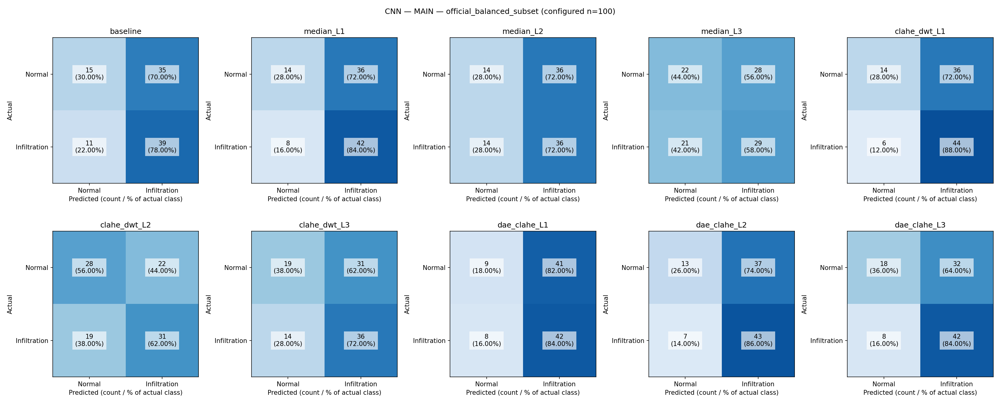

# สรุปผล Notebook v2 release — CNN, Grad-CAM และ SHAP

อ่านผลจาก CSV ในโฟลเดอร์ `CNN/comparison/`, `Grad-CAM/comparison/` และ `SHAP/comparison/` ที่นำมาจากการรัน ไม่ได้ฝึกโมเดลหรือสร้าง heatmap ใหม่เพื่อเขียนรายงานนี้

## ผลสำคัญที่อ่านได้ทันที

**DAE+CLAHE L3 เด่นที่สุดเมื่อพิจารณา Accuracy และการชี้ตำแหน่งร่วมกันในรอบนี้:** Accuracy 60.00%, F1 0.6774, Grad-CAM Pointing Game 36.59% และ SHAP Pointing Game 25.20% ทั้งหมดสูงกว่า baseline แต่ไม่ใช่ผู้ชนะทุกตัวชี้วัดและยังไม่ยืนยันความแตกต่างทางสถิติ

| สิ่งที่ต้องการดู | เงื่อนไขที่ได้ค่าสูงสุด | ผล |
| --- | --- | --- |
| CNN จำแนกถูก / F1 | DAE+CLAHE L3 | Accuracy 60.00% / F1 0.6774 |
| CNN แยกคะแนนสองคลาส (ROC-AUC) | DAE+CLAHE L2 | 0.6504 |
| CNN ตรวจพบ Infiltration (Recall) | CLAHE+DWT L1 | 88.00% |
| Grad-CAM ชี้จุดใน bbox | DAE+CLAHE L3 | 36.59% |
| Grad-CAM พื้นที่ทับซ้อนที่ threshold 0.3 | DAE+CLAHE L1 | IoU 0.1558 |
| SHAP ชี้จุดใน bbox | DAE+CLAHE L3 | 25.20% |
| SHAP พื้นที่ทับซ้อนที่ threshold 0.3 / 0.5 | DAE+CLAHE L2 | IoU 0.00474 / 0.00064 |

## ใช้ภาพอะไร และผลครบแค่ไหน

- ค่าตั้งของชุด release: ResNet50, seed 42; ภาพฝึก 320 (คลาสละ 160), validation 80 (คลาสละ 40), test สมดุล 100 (คลาสละ 50) จาก official split
- XAI ประเมิน 123 ภาพ / 115 คนไข้ที่มี bbox ของ Infiltration รวมภาพที่มีโรคร่วม ไม่ใช่ชุดเดียวกับ test CNN ทั้งหมด
- CNN CSV มีครบ 10 เงื่อนไข ทุกแถวระบุ `complete` และ test 100 ภาพ
- Grad-CAM และ SHAP มีผลรายภาพอย่างละ 1,230 แถว: 10 เงื่อนไข × 123 ภาพ ใช้ชุด image IDs เดียวกันครบทุกเงื่อนไขและทั้งสอง explainer ไม่พบ ID ซ้ำภายในเงื่อนไข
- ตรวจค่าเฉลี่ยทั้ง 4 ตัวชี้วัดของทุกเงื่อนไขและทุกกลุ่มจากผลรายภาพแล้ว ตรงกับ CSV สรุป ไม่มี empty heatmap ตามฟิลด์ที่บันทึก
- **`completion_status.csv` ที่รากโฟลเดอร์ยังเป็นสถานะเก่า `not_run`** จึงอย่าใช้ไฟล์นั้นตัดสินผลรอบนี้ รายงานนี้ยึดไฟล์ comparison ที่นำมาวางและยังไม่ได้แก้สถานะ checkpoint ของระบบ

## 1. CNN — จำแนก Normal กับ Infiltration

Accuracy คือสัดส่วนภาพทั้งหมดที่ทำนายถูก; Precision คือในภาพที่ทำนายเป็น Infiltration มีจริงกี่เปอร์เซ็นต์; Recall คือในภาพ Infiltration จริงตรวจพบกี่เปอร์เซ็นต์; F1 สรุปสมดุล Precision/Recall; ROC-AUC วัดการแยกคะแนนสองคลาสโดยไม่ยึด threshold เดียว ผลที่ threshold จำแนกใช้ค่าตั้ง 0.5

| เงื่อนไข | Accuracy | Precision | Recall | F1 | ROC-AUC | รอบฝึก / รอบที่เลือก |
| --- | --- | --- | --- | --- | --- | --- |
| Baseline | 54.00% | 52.70% | 78.00% | 0.6290 | 0.6044 | 7 / 2 |
| Median L1 | 56.00% | 53.85% | 84.00% | 0.6562 | 0.6164 | 7 / 2 |
| Median L2 | 50.00% | 50.00% | 72.00% | 0.5902 | 0.5304 | 7 / 2 |
| Median L3 | 51.00% | 50.88% | 58.00% | 0.5421 | 0.5276 | 7 / 2 |
| CLAHE+DWT L1 | 58.00% | 55.00% | 88.00% | 0.6769 | 0.6376 | 7 / 2 |
| CLAHE+DWT L2 | 59.00% | 58.49% | 62.00% | 0.6019 | 0.6404 | 8 / 3 |
| CLAHE+DWT L3 | 55.00% | 53.73% | 72.00% | 0.6154 | 0.6088 | 7 / 2 |
| DAE+CLAHE L1 | 51.00% | 50.60% | 84.00% | 0.6316 | 0.6436 | 7 / 2 |
| DAE+CLAHE L2 | 56.00% | 53.75% | 86.00% | 0.6615 | 0.6504 | 7 / 2 |
| DAE+CLAHE L3 | 60.00% | 56.76% | 84.00% | 0.6774 | 0.6380 | 8 / 3 |

**DAE+CLAHE L3 มี Accuracy และ F1 สูงสุด**: Accuracy 60.00% และ F1 0.6774 เทียบ baseline 54.00% และ 0.6290 เพิ่ม Accuracy 6 จุดเปอร์เซ็นต์ หรือจำแนกถูกเพิ่ม 6 ภาพจาก test 100 ภาพ

**DAE+CLAHE L2 มี ROC-AUC สูงสุด** 0.6504 เทียบ baseline 0.6044 ส่วน **CLAHE+DWT L1 มี Recall สูงสุด** 88.00% และ F1 0.6769 ใกล้กับ DAE+CLAHE L3 มาก จึงไม่มีเงื่อนไขเดียวที่ชนะทุกตัวชี้วัด

CLAHE+DWT L2 มี Precision สูงสุด 58.49% แต่ Recall ลดเหลือ 62.00% แสดงว่าการเลือกวิธีต้องพิจารณาทั้งการพลาดภาพ Infiltration และการทำนาย Normal ผิดเป็น Infiltration

CNN ทุกเงื่อนไขฝึกจริง 7–8 รอบและเลือก checkpoint รอบ 2–3 ตาม CSV ต่างจากเพดานที่ config ตั้งไว้ 50 รอบ ซึ่งสอดคล้องกับการหยุดเมื่อ validation ไม่ดีขึ้น ตัวเลขผลอยู่ในช่วง Accuracy 50–60% และ ROC-AUC 0.5276–0.6504 จึงยังเป็นผลนำร่องที่มีความสามารถจำแนกจำกัด

## 2. อ่านคะแนน XAI อย่างไร

- **Pointing Game:** จุดที่ heatmap มีค่าสูงสุดอยู่ในกรอบรอยโรคของแพทย์หรือไม่ รายงานเป็นเปอร์เซ็นต์ภาพที่ชี้ถูก
- **Energy inside:** สัดส่วนผลรวมค่าความสนใจที่อยู่ภายในกรอบรอยโรค ไม่ใช่ความแม่นยำจำแนกโรค
- **IoU:** พื้นที่ทับซ้อนระหว่าง heatmap ที่แปลงเป็นหน้ากากกับกรอบแพทย์ หารด้วยพื้นที่รวม มีค่าตั้งแต่ 0 ถึง 1
- **IoU@0.3 / IoU@0.5:** ใช้ threshold 0.3 หรือ 0.5 ตัด heatmap ที่ normalize แล้ว ไม่ใช่เปอร์เซ็นต์ภาพที่ผ่านเกณฑ์ IoU
- **95% CI:** ช่วงความเชื่อมั่นที่ไฟล์ผลรายงาน โค้ดโครงการใช้ bootstrap ระดับคนไข้ 2,000 ครั้ง ตารางนี้ไม่ได้คำนวณการทดสอบผลต่างระหว่างวิธี

ทุกตัวชี้วัดในตารางยิ่งสูงยิ่งดี SHAP ใช้ส่วน attribution บวกในการประเมิน bbox; attribution ลบไม่ได้รวมในคะแนนเหล่านี้

## 3. Grad-CAM — โมเดลเน้นบริเวณใด

ตารางนี้ใช้กลุ่ม overall ครบ 123 ภาพ ตัวเลขในวงเล็บเป็น 95% CI จากไฟล์ผล

| เงื่อนไข | Pointing Game (95% CI) | Energy inside (95% CI) | IoU@0.3 (95% CI) | IoU@0.5 (95% CI) |
| --- | --- | --- | --- | --- |
| Baseline | 22.76% (15.20–30.08) | 16.08% (13.02–19.17) | 0.1321 (0.1060–0.1577) | 0.0983 (0.0736–0.1236) |
| Median L1 | 24.39% (16.67–32.26) | 16.78% (13.60–20.06) | 0.1314 (0.1070–0.1559) | 0.0970 (0.0725–0.1215) |
| Median L2 | 26.02% (18.18–33.89) | 17.52% (14.24–20.93) | 0.1405 (0.1175–0.1645) | 0.1049 (0.0805–0.1302) |
| Median L3 | 17.07% (10.40–23.81) | 14.92% (12.17–17.66) | 0.1182 (0.0968–0.1399) | 0.0902 (0.0703–0.1100) |
| CLAHE+DWT L1 | 27.64% (19.85–35.77) | 16.78% (13.92–19.77) | 0.1416 (0.1186–0.1647) | 0.1034 (0.0826–0.1245) |
| CLAHE+DWT L2 | 27.64% (19.83–35.71) | 17.17% (13.88–20.71) | 0.1344 (0.1090–0.1595) | 0.1068 (0.0814–0.1314) |
| CLAHE+DWT L3 | 23.58% (16.13–31.41) | 15.51% (12.49–18.76) | 0.1151 (0.0929–0.1393) | 0.0903 (0.0689–0.1137) |
| DAE+CLAHE L1 | 33.33% (24.79–41.46) | 18.69% (15.48–22.09) | 0.1558 (0.1315–0.1814) | 0.1171 (0.0945–0.1405) |
| DAE+CLAHE L2 | 18.70% (12.00–25.60) | 15.01% (12.38–17.89) | 0.1143 (0.0949–0.1333) | 0.0851 (0.0661–0.1046) |
| DAE+CLAHE L3 | 36.59% (27.96–45.24) | 20.05% (16.56–23.83) | 0.1465 (0.1217–0.1714) | 0.1177 (0.0945–0.1413) |

**DAE+CLAHE L3 มี Pointing Game สูงสุด 36.59% (45/123 ภาพ)** เทียบ baseline 22.76% (28/123 ภาพ) เพิ่ม 13.82 จุดเปอร์เซ็นต์ และมี Energy inside สูงสุด 20.05% รวมถึง IoU@0.5 สูงสุด 0.1177

**DAE+CLAHE L1 มี IoU@0.3 สูงสุด 0.1558** เทียบ baseline 0.1321 จึงอาจให้การทับซ้อนของพื้นที่ดีกว่า L3 ที่ threshold นี้ แม้ L3 ชี้จุดสูงสุดได้ถูกมากกว่า

Median L2 ดีกว่า baseline ในภาพรวม แต่ Median L3 ลดลง ส่วน CLAHE+DWT L1/L2 ให้ผลดีกว่า L3 หลายตัวชี้วัด เป็นแนวโน้มที่ควรศึกษาต่อเรื่องการสูญเสียรายละเอียด ไม่ใช่หลักฐานยืนยันสาเหตุ over-smoothing

DAE+CLAHE L2 ต่ำกว่า baseline ทุกตัวชี้วัด Grad-CAM ในภาพรวม ขณะที่ L1 และ L3 สูงกว่า จึงไม่ควรสรุปว่าปรับระดับแรงขึ้นแล้วผลจะดีขึ้นหรือลดลงต่อเนื่อง

## 4. SHAP — ส่วนใดของภาพเพิ่มคะแนน Infiltration

ใช้ attribution บวกในการประเมินตำแหน่ง เก็บ signed attribution สำหรับการแสดงผลแยกต่างหาก ตารางนี้ใช้ overall ครบ 123 ภาพ

| เงื่อนไข | Pointing Game (95% CI) | Energy inside (95% CI) | IoU@0.3 (95% CI) | IoU@0.5 (95% CI) |
| --- | --- | --- | --- | --- |
| Baseline | 10.57% (5.69–16.26) | 11.20% (9.31–13.16) | 0.00358 (0.00267–0.00472) | 0.00039 (0.00026–0.00056) |
| Median L1 | 8.13% (3.97–13.12) | 11.49% (9.57–13.51) | 0.00357 (0.00269–0.00454) | 0.00036 (0.00025–0.00049) |
| Median L2 | 13.01% (7.44–19.35) | 11.50% (9.53–13.59) | 0.00410 (0.00297–0.00534) | 0.00051 (0.00033–0.00072) |
| Median L3 | 13.82% (8.06–20.49) | 11.73% (9.70–13.84) | 0.00401 (0.00279–0.00548) | 0.00054 (0.00031–0.00084) |
| CLAHE+DWT L1 | 12.20% (6.92–18.25) | 10.95% (9.20–12.83) | 0.00267 (0.00200–0.00342) | 0.00032 (0.00020–0.00045) |
| CLAHE+DWT L2 | 13.82% (8.06–20.16) | 11.85% (9.85–13.99) | 0.00239 (0.00182–0.00298) | 0.00025 (0.00018–0.00033) |
| CLAHE+DWT L3 | 13.01% (7.44–19.01) | 10.95% (9.13–12.94) | 0.00168 (0.00120–0.00219) | 0.00021 (0.00015–0.00029) |
| DAE+CLAHE L1 | 17.07% (10.57–24.00) | 12.40% (10.41–14.53) | 0.00464 (0.00360–0.00578) | 0.00054 (0.00036–0.00076) |
| DAE+CLAHE L2 | 19.51% (12.80–26.61) | 11.88% (9.95–13.93) | 0.00474 (0.00375–0.00589) | 0.00064 (0.00044–0.00090) |
| DAE+CLAHE L3 | 25.20% (17.74–32.79) | 13.55% (11.41–15.82) | 0.00469 (0.00376–0.00560) | 0.00058 (0.00044–0.00073) |

**DAE+CLAHE L3 มี Pointing Game สูงสุด 25.20% (31/123 ภาพ)** เทียบ baseline 10.57% (13/123 ภาพ) เพิ่ม 14.63 จุดเปอร์เซ็นต์ และมี Energy inside สูงสุด 13.55% เทียบ baseline 11.20%

**DAE+CLAHE L2 มี IoU สูงสุดทั้งสอง threshold:** IoU@0.3 = 0.00474 และ IoU@0.5 = 0.00064 ส่วน L3 ชนะด้านการชี้จุด จึงเห็นอีกครั้งว่าคะแนนชี้จุดและคะแนนทับซ้อนพื้นที่อาจเลือกคนละวิธี

ค่า IoU ของ SHAP ต่ำมากทุกเงื่อนไข และต่ำกว่า Grad-CAM ภายใต้การประเมินเดียวกัน แสดงว่าพื้นที่ attribution บวกที่ผ่าน threshold ทับซ้อน bbox ได้น้อยในรอบนี้ แต่ตัวเลขเพียงอย่างเดียวไม่บอกว่าเกิดจากรูปทรง attribution, threshold, normalization หรือการเรียนรู้ของโมเดล

Median L3 ให้ Pointing Game ดีกว่า L1 ใน SHAP ต่างจากแนวโน้ม Grad-CAM จึงยังไม่มีหลักฐานว่า denoising ระดับสูงทำให้ XAI แย่ลงเหมือนกันทุกวิธีอธิบาย

## 5. ผลเฉพาะ Infiltration เทียบกับภาพที่มีโรคร่วม

XAI แบ่งเป็น **Pure** (Infiltration อย่างเดียว) 19 ภาพ / 18 คนไข้, **Mixed high risk** 64 ภาพ / 61 คนไข้ และ **Mixed low risk** 40 ภาพ / 38 คนไข้ ตาม risk_flag ในไฟล์ผล กลุ่ม high risk ในโค้ดหมายถึงมี Effusion หรือ Atelectasis ร่วมด้วย ไม่ใช่ระดับความรุนแรงทางคลินิกของคนไข้ จำนวนคนไข้ของแต่ละกลุ่มไม่ควรนำมาบวก เพราะคนไข้หนึ่งคนอาจมีภาพอยู่ต่างกลุ่ม

ผลดีของ DAE+CLAHE L3 ไม่ได้กระจายเท่ากันทุกกลุ่ม: ใน Pure ค่า Pointing Game เท่ากับ baseline ทั้ง Grad-CAM (15.79%) และ SHAP (10.53%) ส่วนกลุ่มโรคร่วมให้ผลสูงกว่า จึงยังสรุปไม่ได้ว่า L3 ช่วยระบุตำแหน่ง Infiltration-only อย่างชัดเจน กลุ่ม Pure มีเพียง 19 ภาพและช่วงความเชื่อมั่นกว้าง

### Grad-CAM: Pointing Game แยกกลุ่ม

| เงื่อนไข | Pure: 19 ภาพ | Mixed high risk: 64 ภาพ | Mixed low risk: 40 ภาพ |
| --- | --- | --- | --- |
| Baseline | 15.79% | 23.44% | 25.00% |
| Median L1 | 21.05% | 18.75% | 35.00% |
| Median L2 | 15.79% | 26.56% | 30.00% |
| Median L3 | 10.53% | 15.62% | 22.50% |
| CLAHE+DWT L1 | 26.32% | 28.12% | 27.50% |
| CLAHE+DWT L2 | 15.79% | 26.56% | 35.00% |
| CLAHE+DWT L3 | 15.79% | 23.44% | 27.50% |
| DAE+CLAHE L1 | 10.53% | 31.25% | 47.50% |
| DAE+CLAHE L2 | 5.26% | 17.19% | 27.50% |
| DAE+CLAHE L3 | 15.79% | 37.50% | 45.00% |

### SHAP: Pointing Game แยกกลุ่ม

| เงื่อนไข | Pure: 19 ภาพ | Mixed high risk: 64 ภาพ | Mixed low risk: 40 ภาพ |
| --- | --- | --- | --- |
| Baseline | 10.53% | 7.81% | 15.00% |
| Median L1 | 10.53% | 6.25% | 10.00% |
| Median L2 | 15.79% | 12.50% | 12.50% |
| Median L3 | 21.05% | 9.38% | 17.50% |
| CLAHE+DWT L1 | 15.79% | 4.69% | 22.50% |
| CLAHE+DWT L2 | 15.79% | 10.94% | 17.50% |
| CLAHE+DWT L3 | 5.26% | 15.62% | 12.50% |
| DAE+CLAHE L1 | 15.79% | 12.50% | 25.00% |
| DAE+CLAHE L2 | 5.26% | 28.12% | 12.50% |
| DAE+CLAHE L3 | 10.53% | 26.56% | 30.00% |

คะแนน Energy inside, IoU และ 95% CI แยกกลุ่มครบทั้งหมดอยู่ใน CSV ของแต่ละ explainer

## 6. สิ่งที่ผลรอบนี้ตอบได้และข้อจำกัด

ผลสนับสนุนว่า **การเตรียมภาพบางเงื่อนไขช่วยทั้งการจำแนกและการชี้ตำแหน่งเมื่อเทียบ baseline** แต่ผลขึ้นกับระดับและตัวชี้วัด DAE+CLAHE L3 เป็นตัวเลือกเด่นของรอบนี้ ขณะที่ L1/L2 มีจุดเด่นต่างกัน การเพิ่มระดับไม่ได้รับประกันว่าทุกคะแนนดีขึ้น

- Test CNN มีเพียง 100 ภาพ ไม่ใช่ official binary test ทั้งชุด และ XAI มี 123 ภาพ ผลจึงเป็นผลของชุดนำร่องนี้
- ตารางจัดอันดับตามค่าที่วัดได้ ยังไม่ได้ทดสอบผลต่างแบบจับคู่หรือปรับการเปรียบเทียบหลายเงื่อนไข จึงไม่ใช้คำว่า “ดีกว่าอย่างมีนัยสำคัญ” การทับซ้อนของ CI แต่ละวิธีก็ไม่ใช่การทดสอบผลต่างโดยตรง
- ค่า Accuracy, F1 และ IoU วัดคนละเรื่อง ต้องพิจารณาร่วมกัน ห้ามตีความ Pointing Game เป็น Accuracy จำแนกโรค
- DAE+CLAHE L1–L3 ใช้ DAE ตัวเดียวกันและเปลี่ยน clip limit ของ CLAHE (2/4/8) จึงเป็นการเปลี่ยน contrast หลัง DAE ไม่ใช่การเปลี่ยนความแรง DAE ส่วน CLAHE+DWT เปลี่ยนหลายค่าร่วมกัน
- ผล CNN และ XAI ยังไม่พิสูจน์ว่า over-smoothing เป็นสาเหตุของคะแนนที่ลดลง และยังไม่ได้ประเมินความแปรปรวนจากการฝึกหลาย seed
- ข้อมูลที่นำมาวางเป็นไฟล์ comparison สรุปและผล XAI รายภาพ ไม่ใช่ชุด checkpoint/manifest ครบทั้งหมด จึงตรวจเทียบ checkpoint หรือประวัติการฝึกจากเครื่อง Colab โดยตรงไม่ได้

## 7. ไฟล์สำหรับอ่านต่อ

| รายการ | ไฟล์ |
| --- | --- |
| ผล CNN ครบทุกเงื่อนไข | [CNN CSV](CNN/comparison/metrics_all_conditions.csv) |
| ผล Grad-CAM พร้อม CI และกลุ่มย่อย | [Grad-CAM CSV](Grad-CAM/comparison/metrics_all_conditions.csv) |
| ผล Grad-CAM รายภาพ | [Grad-CAM รายภาพ](Grad-CAM/comparison/per_image_metrics_all_conditions.csv) |
| ผล SHAP พร้อม CI และกลุ่มย่อย | [SHAP CSV](SHAP/comparison/metrics_all_conditions.csv) |
| ผล SHAP รายภาพ | [SHAP รายภาพ](SHAP/comparison/per_image_metrics_all_conditions.csv) |
| ตัวอย่าง Grad-CAM เทียบ 10 เงื่อนไข | [ภาพตัวอย่าง](Grad-CAM/comparison/heatmap_comparison_00000032_037.png) |
| ตัวอย่าง SHAP เทียบ 10 เงื่อนไข | [ภาพตัวอย่าง](SHAP/comparison/heatmap_comparison_00000032_037.png) |

ภาพตัวอย่างอีกสองภาพของแต่ละ explainer อยู่ใน `comparison/` ชื่อ `heatmap_comparison_00000211_016.png` และ `heatmap_comparison_00000468_041.png` ภาพเหล่านี้ใช้ประกอบการอ่าน ไม่แทนการประเมินทั้ง 123 ภาพ
