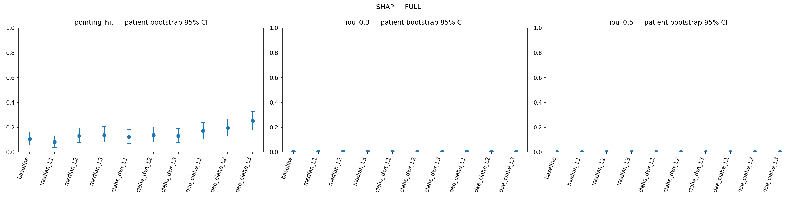

# ผล SHAP — Notebook v2 release

ประเมินครบ 10 เงื่อนไข × 123 ภาพ / 115 คนไข้ ใช้ผลรายภาพ 1,230 แถว ค่าในวงเล็บเป็น 95% CI

| เงื่อนไข | Pointing Game (95% CI) | Energy inside (95% CI) | IoU@0.3 (95% CI) | IoU@0.5 (95% CI) |
| --- | --- | --- | --- | --- |
| Baseline | 10.57% (5.69–16.26) | 11.20% (9.31–13.16) | 0.00358 (0.00267–0.00472) | 0.00039 (0.00026–0.00056) |
| Median L1 | 8.13% (3.97–13.12) | 11.49% (9.57–13.51) | 0.00357 (0.00269–0.00454) | 0.00036 (0.00025–0.00049) |
| Median L2 | 13.01% (7.44–19.35) | 11.50% (9.53–13.59) | 0.00410 (0.00297–0.00534) | 0.00051 (0.00033–0.00072) |
| Median L3 | 13.82% (8.06–20.49) | 11.73% (9.70–13.84) | 0.00401 (0.00279–0.00548) | 0.00054 (0.00031–0.00084) |
| CLAHE+DWT L1 | 12.20% (6.92–18.25) | 10.95% (9.20–12.83) | 0.00267 (0.00200–0.00342) | 0.00032 (0.00020–0.00045) |
| CLAHE+DWT L2 | 13.82% (8.06–20.16) | 11.85% (9.85–13.99) | 0.00239 (0.00182–0.00298) | 0.00025 (0.00018–0.00033) |
| CLAHE+DWT L3 | 13.01% (7.44–19.01) | 10.95% (9.13–12.94) | 0.00168 (0.00120–0.00219) | 0.00021 (0.00015–0.00029) |
| DAE+CLAHE L1 | 17.07% (10.57–24.00) | 12.40% (10.41–14.53) | 0.00464 (0.00360–0.00578) | 0.00054 (0.00036–0.00076) |
| DAE+CLAHE L2 | 19.51% (12.80–26.61) | 11.88% (9.95–13.93) | 0.00474 (0.00375–0.00589) | 0.00064 (0.00044–0.00090) |
| DAE+CLAHE L3 | 25.20% (17.74–32.79) | 13.55% (11.41–15.82) | 0.00469 (0.00376–0.00560) | 0.00058 (0.00044–0.00073) |

**DAE+CLAHE L3 มี Pointing Game สูงสุด 25.20% (31/123 ภาพ)** เทียบ baseline 10.57% (13/123 ภาพ) เพิ่ม 14.63 จุดเปอร์เซ็นต์ และมี Energy inside สูงสุด 13.55% เทียบ baseline 11.20%

**DAE+CLAHE L2 มี IoU สูงสุดทั้งสอง threshold:** IoU@0.3 = 0.00474 และ IoU@0.5 = 0.00064 ส่วน L3 ชนะด้านการชี้จุด จึงเห็นอีกครั้งว่าคะแนนชี้จุดและคะแนนทับซ้อนพื้นที่อาจเลือกคนละวิธี

ค่า IoU ของ SHAP ต่ำมากทุกเงื่อนไข และต่ำกว่า Grad-CAM ภายใต้การประเมินเดียวกัน แสดงว่าพื้นที่ attribution บวกที่ผ่าน threshold ทับซ้อน bbox ได้น้อยในรอบนี้ แต่ตัวเลขเพียงอย่างเดียวไม่บอกว่าเกิดจากรูปทรง attribution, threshold, normalization หรือการเรียนรู้ของโมเดล

Median L3 ให้ Pointing Game ดีกว่า L1 ใน SHAP ต่างจากแนวโน้ม Grad-CAM จึงยังไม่มีหลักฐานว่า denoising ระดับสูงทำให้ XAI แย่ลงเหมือนกันทุกวิธีอธิบาย

## ความหมายของคะแนน

- **Pointing Game:** จุดที่ heatmap มีค่าสูงสุดอยู่ในกรอบรอยโรคของแพทย์หรือไม่ รายงานเป็นเปอร์เซ็นต์ภาพที่ชี้ถูก
- **Energy inside:** สัดส่วนผลรวมค่าความสนใจที่อยู่ภายในกรอบรอยโรค ไม่ใช่ความแม่นยำจำแนกโรค
- **IoU:** พื้นที่ทับซ้อนระหว่าง heatmap ที่แปลงเป็นหน้ากากกับกรอบแพทย์ หารด้วยพื้นที่รวม มีค่าตั้งแต่ 0 ถึง 1
- **IoU@0.3 / IoU@0.5:** ใช้ threshold 0.3 หรือ 0.5 ตัด heatmap ที่ normalize แล้ว ไม่ใช่เปอร์เซ็นต์ภาพที่ผ่านเกณฑ์ IoU
- **95% CI:** ช่วงความเชื่อมั่นที่ไฟล์ผลรายงาน โค้ดโครงการใช้ bootstrap ระดับคนไข้ 2,000 ครั้ง ตารางนี้ไม่ได้คำนวณการทดสอบผลต่างระหว่างวิธี

ทุกตัวชี้วัดในตารางยิ่งสูงยิ่งดี SHAP ใช้ส่วน attribution บวกในการประเมิน bbox; attribution ลบไม่ได้รวมในคะแนนเหล่านี้

## Pointing Game แยกกลุ่ม

| เงื่อนไข | Pure: 19 ภาพ | Mixed high risk: 64 ภาพ | Mixed low risk: 40 ภาพ |
| --- | --- | --- | --- |
| Baseline | 10.53% | 7.81% | 15.00% |
| Median L1 | 10.53% | 6.25% | 10.00% |
| Median L2 | 15.79% | 12.50% | 12.50% |
| Median L3 | 21.05% | 9.38% | 17.50% |
| CLAHE+DWT L1 | 15.79% | 4.69% | 22.50% |
| CLAHE+DWT L2 | 15.79% | 10.94% | 17.50% |
| CLAHE+DWT L3 | 5.26% | 15.62% | 12.50% |
| DAE+CLAHE L1 | 15.79% | 12.50% | 25.00% |
| DAE+CLAHE L2 | 5.26% | 28.12% | 12.50% |
| DAE+CLAHE L3 | 10.53% | 26.56% | 30.00% |

XAI แบ่งเป็น **Pure** (Infiltration อย่างเดียว) 19 ภาพ / 18 คนไข้, **Mixed high risk** 64 ภาพ / 61 คนไข้ และ **Mixed low risk** 40 ภาพ / 38 คนไข้ ตาม risk_flag ในไฟล์ผล กลุ่ม high risk ในโค้ดหมายถึงมี Effusion หรือ Atelectasis ร่วมด้วย ไม่ใช่ระดับความรุนแรงทางคลินิกของคนไข้ จำนวนคนไข้ของแต่ละกลุ่มไม่ควรนำมาบวก เพราะคนไข้หนึ่งคนอาจมีภาพอยู่ต่างกลุ่ม

ผลดีของ DAE+CLAHE L3 ไม่ได้กระจายเท่ากันทุกกลุ่ม: ใน Pure ค่า Pointing Game เท่ากับ baseline ทั้ง Grad-CAM (15.79%) และ SHAP (10.53%) ส่วนกลุ่มโรคร่วมให้ผลสูงกว่า จึงยังสรุปไม่ได้ว่า L3 ช่วยระบุตำแหน่ง Infiltration-only อย่างชัดเจน กลุ่ม Pure มีเพียง 19 ภาพและช่วงความเชื่อมั่นกว้าง

อ่าน [ผลรวม CNN และ XAI พร้อมข้อจำกัด](../README.md), [CSV สรุปพร้อม CI ทุกกลุ่ม](comparison/metrics_all_conditions.csv) และ [CSV รายภาพ](comparison/per_image_metrics_all_conditions.csv) รายงานนี้จัดอันดับตามค่าที่วัดได้ ยังไม่ได้ทดสอบความแตกต่างทางสถิติระหว่างวิธี
