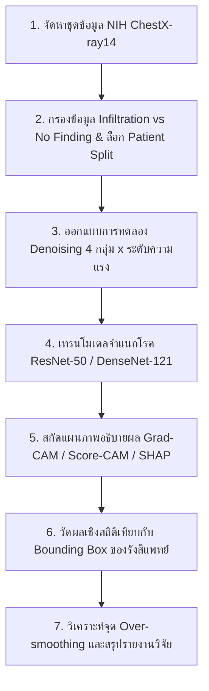

# เค้าโครงโครงงานคอมพิวเตอร์ (Computer Project Proposal)
### วิชา CP353761 สัมมนาทางวิทยาการคอมพิวเตอร์ ภาคเรียนที่ 1 ปีการศึกษา 2569
**สาขาวิชาวิทยาการคอมพิวเตอร์ วิทยาลัยการคอมพิวเตอร์ มหาวิทยาลัยขอนแก่น**

---

```text
CS2569/หมายเลขกลุ่ม: CP-SEMINAR-2569
เค้าโครงโครงงานคอมพิวเตอร์
เรื่อง: การเพิ่มประสิทธิภาพการตรวจจับภาวะปอดอักเสบจากภาพเอกซเรย์ด้วยการลดสัญญาณรบกวนและปัญญาประดิษฐ์ที่อธิบายได้
(Enhancing Chest X-RAY Infiltration Detection Using Noise Reduction and Explainable AI)

โดย:
1. นายปิยะพล ตุ่นป่า รหัสประจำตัว 673380280-2
2. นายสัพพัญญู คำตุ้ม รหัสประจำตัว 673380066-4

อาจารย์ที่ปรึกษาโครงงาน: อ. ดร.พบพร ด่านวิรุทัย
(เดือน ตุลาคม พ.ศ. 2569)
```

---

## 1. ชื่อหัวข้อโครงงาน
* **ภาษาไทย:** การเพิ่มประสิทธิภาพการตรวจจับภาวะปอดอักเสบจากภาพเอกซเรย์ด้วยการลดสัญญาณรบกวนและปัญญาประดิษฐ์ที่อธิบายได้
* **ภาษาอังกฤษ:** Enhancing Chest X-RAY Infiltration Detection Using Noise Reduction and Explainable AI

---

## 2. หลักการและเหตุผล (Background and Rationale)

โรคระบบทางเดินหายใจและความผิดปกติของปอดถือเป็นหนึ่งในสาเหตุสำคัญของการเจ็บป่วยและเสียชีวิตในระดับสากล โดยเฉพาะภาวะฝ้าในปอดหรือปอดอักเสบแทรกซึม (Pulmonary Infiltration) ซึ่งเกิดจากการสะสมของของเหลว เซลล์อักเสบ หรือหนองในถุงลมปอดจากสาเหตุต่าง ๆ เช่น โรคปอดบวม (Pneumonia) หรือการติดเชื้อในระบบทางเดินหายใจ (World Health Organization [WHO], 2024) การตรวจเอกซเรย์ทรวงอก (Chest X-ray: CXR) จัดเป็นหัตถการรังสีวินิจฉัยด่านแรกที่นิยมใช้มากที่สุดเนื่องจากมีความรวดเร็ว เข้าถึงง่าย และมีค่าใช้จ่ายต่ำ อย่างไรก็ตาม ด้วยปริมาณภาพถ่ายรังสีที่เพิ่มขึ้นอย่างมหาศาล สวนทางกับจำนวนรังสีแพทย์ผู้เชี่ยวชาญ ประกอบกับลักษณะรอยโรคของ Infiltration มักมีขอบเขตไม่ชัดเจนและกลมกลืนกับเนื้อเยื่อปอดปกติ (Diffuse and ill-defined margins) จึงมักเกิดความแปรปรวนในการอ่านผลระหว่างผู้ตรวจ (Inter-observer variability) และส่งผลให้แพทย์มีภาระงานสูงจนอาจเกิดความผิดพลาดในการวินิจฉัยเบื้องต้นได้ (Raoof et al., 2012; Wang et al., 2017)

ด้วยเหตุนี้ ในช่วงไม่กี่ปีที่ผ่านมาจึงมีการนำปัญญาประดิษฐ์ โดยเฉพาะการเรียนรู้เชิงลึก (Deep Learning) และโครงข่ายประสาทเทียมแบบคอนโวลูชัน (Convolutional Neural Networks: CNN) มาประยุกต์ใช้เพื่อตรวจจับและจำแนกความผิดปกติจากภาพเอกซเรย์ทรวงอก ซึ่งมีประสิทธิภาพและค่าความแม่นยำสูงในระดับเทียบเท่าผู้เชี่ยวชาญ (Rajpurkar et al., 2017) ทว่าปัญหาสำคัญที่เป็นอุปสรรคต่อการนำไปใช้จริงในงานบริการทางการแพทย์คือ **"ปัญหาโมเดลกล่องดำ" (Black-Box Problem)** เนื่องจากโครงข่ายประสาทเทียมตัดสินผลลัพธ์ผ่านความสัมพันธ์ทางคณิตศาสตร์ที่ซับซ้อน ทำให้บุคลากรทางการแพทย์ไม่สามารถทราบได้ว่า โมเดลตัดสินใจจากรอยโรคจริงหรือจากสิ่งแปลกปลอม (Artifacts/Confounders) เช่น เงากระดูกไหปลาร้า เงากระดูกซี่โครง สายระโยงทางการแพทย์ หรือสัญญาณรบกวน (Noise) บนภาพถ่าย ส่งผลให้ขาดความน่าเชื่อถือและความโปร่งใสในการนำไปสนับสนุนการตัดสินใจทางคลินิก (Rudin, 2019; van der Velden et al., 2022)

เพื่อแก้ปัญหาความโปร่งใส เทคโนโลยีปัญญาประดิษฐ์ที่อธิบายได้ (Explainable Artificial Intelligence: XAI) จึงมีบทบาทสำคัญอย่างยิ่ง โดยเฉพาะเทคนิคการสร้างแผนที่ความร้อน (Saliency Maps) เช่น Grad-CAM, Score-CAM และ SHAP (SHapley Additive exPlanations) ซึ่งช่วยแสดงตำแหน่งพื้นที่ในภาพที่มีอิทธิพลต่อการตัดสินใจของโมเดล อย่างไรก็ดี คุณภาพของภาพถ่ายเอกซเรย์ในเวชปฏิบัติจริงมักมีสัญญาณรบกวนเชิงควอนตัม (Quantum Mottle / Poisson Noise) และมีความเปรียบต่างต่ำ (Low Contrast) ซึ่งไม่เพียงแต่ลดทอนประสิทธิภาพการจำแนกโรคของโมเดล แต่ยังส่งผลกระทบอย่างมีนัยสำคัญต่อความเสถียรและทิศทางการให้ความสำคัญของแผนภาพ XAI อีกด้วย (Adebayo et al., 2018) ส่งผลให้จุดความสนใจของ AI มักเกิดการเบี่ยงเบน (Attention Drifting) หลุดออกไปนอกรอยโรคจริง

การนำเทคนิคการประมวลผลภาพเพื่อลดสัญญาณรบกวน (Image Denoising) เข้ามาช่วยจึงเป็นขั้นตอนที่มีความจำเป็นอย่างยิ่ง เช่น ตัวกรองเชิงพื้นที่ Median Filter, การผสานการเพิ่มคอนทราสต์กับการแปลงเวฟเล็ต (CLAHE + DWT) หรือการใช้แบบจำลองการเรียนรู้เชิงลึก Denoising Autoencoder ร่วมกับ CLAHE (DAE + CLAHE) อย่างไรก็ตาม วรรณกรรมวิจัยในปัจจุบันยังขาดการศึกษาเชิงลึกใน 3 ประเด็นหลัก:
1. ขาดการประเมินผลเชิงเปรียบเทียบที่เป็นธรรม (Fair Comparison) ระหว่างตัวกรองแบบดั้งเดิมกับ Deep Denoising บนงานตรวจจับ Infiltration ภายใต้สถาปัตยกรรมเดียวกัน
2. ยังไม่มีการศึกษาปรากฏการณ์ **Over-smoothing** ที่ชัดเจนว่าการลดสัญญาณรบกวนที่แรงเกินไปจะทำลายรายละเอียดฝ้าบางๆ ในถุงลมจนส่งผลให้ความแม่นยำในการชี้ตำแหน่งของ XAI ลดลงหรือไม่
3. ขาดการวัดผล XAI เชิงปริมาณด้วยสถิติที่เป็นกลาง (Quantitative Localization Benchmark) โดยส่วนใหญ่อาศัยเพียงการสังเกตด้วยสายตา (Qualitative Visual Inspection) ซึ่งเสี่ยงต่อการเกิดอคติในการเลือกภาพ (Cherry-picking bias)

ดังนั้น คณะผู้จัดทำจึงมีแนวคิดในการพัฒนาโครงงานเรื่อง **"การเพิ่มประสิทธิภาพการตรวจจับภาวะปอดอักเสบจากภาพเอกซเรย์ด้วยการลดสัญญาณรบกวนและปัญญาประดิษฐ์ที่อธิบายได้" (Enhancing Chest X-RAY Infiltration Detection Using Noise Reduction and Explainable AI)** เพื่อศึกษาและเปรียบเทียบผลกระทบของเทคนิคการลดสัญญาณรบกวนในระดับความแรงต่าง ๆ ต่อประสิทธิภาพการจำแนกโรค ควบคู่ไปกับการประเมินความแม่นยำของการชี้ตำแหน่งรอยโรค (Pointing Game, Saliency Energy, และ IoU) เทียบกับกรอบรอยโรคจริงของรังสีแพทย์ (Ground-Truth Bounding Box) ผลลัพธ์จากโครงงานนี้จะช่วยสร้างความเข้าใจถึงผลกระทบของการเตรียมภาพต่อความสามารถในการอธิบายผลของ AI สร้างความโปร่งใส และยกระดับความน่าเชื่อถือของระบบปัญญาประดิษฐ์สำหรับการนำไปประยุกต์ใช้ในทางการแพทย์ได้อย่างแท้จริง

---

## 3. วัตถุประสงค์ของโครงงาน (Project Objectives)

1. เพื่อศึกษา ทบทวนวรรณกรรม และสังเคราะห์เทคนิคการลดสัญญาณรบกวน (Image Denoising) และปัญญาประดิษฐ์ที่อธิบายได้ (Explainable AI) สำหรับการตรวจจับรอยโรคฝ้าในปอด (Infiltration) จากภาพเอกซเรย์ทรวงอก
2. เพื่อพัฒนาไปป์ไลน์แบบจำลองปัญญาประดิษฐ์แบบคอนโวลูชัน (CNN) ในการตรวจจับภาวะ Infiltration ผ่านกระบวนการลดสัญญาณรบกวนรูปแบบต่าง ๆ ได้แก่ Median Filter, CLAHE + DWT, และ DAE + CLAHE ที่ระดับความแรงควบคุม
3. เพื่อประยุกต์ใช้เทคนิค Explainable AI (Grad-CAM, Score-CAM, และ SHAP) ในการอธิบายผลการตัดสินใจของแบบจำลอง และประเมินความสอดคล้องเชิงพื้นที่กับกรอบรอยโรคจริงของรังสีแพทย์ (Ground-Truth Bounding Box)
4. เพื่อประเมินประสิทธิภาพเชิงเปรียบเทียบ (Fair Comparison) ระหว่างแนวทางที่ไม่มีการลดสัญญาณรบกวน (Baseline Raw CXR) กับแนวทางที่มีการลดสัญญาณรบกวน ทั้งในมิติความแม่นยำของการจำแนกโรค (Classification Metrics) และความแม่นยำเชิงปริมาณของการอธิบายผล (XAI Localization Metrics) พร้อมทั้งค้นหาจุดสมดุลที่ป้องกันปัญหา Over-smoothing

---

## 4. ทฤษฎีและผลงานวิจัยที่เกี่ยวข้อง (Literature Review & Theory)

### 4.1 พยาธิสภาพของภาวะฝ้าในปอด (Pulmonary Infiltration)
ภาวะ Infiltration ทางรังสีวิทยามีลักษณะเป็นความทึบแสงในเนื้อปอด (Lung Parenchymal Opacity) เกิดจากการที่อากาศในถุงลมปอดถูกแทนที่ด้วยของเหลวหรือเซลล์อักเสบ รอยโรคนี้มีลักษณะสำคัญคือเป็นฝ้าจาง ๆ กระจายตัว (Diffuse, ill-defined, hazy ground-glass opacities) ไม่มีขอบเขตทรงกลมชัดเจนเหมือนก้อนเนื้อ (Mass) หรือจุดเดี่ยว (Nodule) ทำให้การตรวจจับด้วยคอมพิวเตอร์มีความท้าทายสูง โดยเฉพาะเมื่อภาพมีสัญญาณรบกวนทางรังสี (Quantum Noise) หรือถูกบดบังด้วยกระดูกซี่โครง

### 4.2 สถาปัตยกรรมโครงข่ายประสาทเทียมสำหรับการประมวลผลภาพทางการแพทย์
* **ResNet-50 (He et al., 2016):** สถาปัตยกรรม Residual Network ที่ใช้ Residual Connections ($y = \mathcal{F}(x) + x$) ช่วยให้สามารถฝึกฝนโครงข่ายที่มีความลึกสูงได้โดยไม่เกิดปัญหา Vanishing Gradient ในงานวิจัยนี้ถูกใช้เป็นโมเดลหลัก (Fixed Backbone) เพื่อควบคุมตัวแปรให้เป็น Fair Comparison
* **DenseNet-121 และ CheXNet (Rajpurkar et al., 2017):** สถาปัตยกรรม Dense Convolutional Network ที่เชื่อมโยง Feature Maps จากทุกเลเยอร์ก่อนหน้าเข้าด้วยกันแบบ Concatenation ($x_\ell = H_\ell([x_0, x_1, \dots, x_{\ell-1}])$) ซึ่ง CheXNet พิสูจน์แล้วว่ามีประสิทธิภาพระดับเทียบเท่ารังสีแพทย์ในการตรวจจับภาวะปอดอักเสบ เนื่องจากช่วยให้ฟีเจอร์ความเปรียบต่างต่ำจากชั้นต้นถูกส่งผ่านไปยังชั้นตัดสินใจได้โดยตรง

### 4.3 เทคนิคการลดสัญญาณรบกวนและการเพิ่มคุณภาพของภาพ (Image Denoising & Enhancement)
* **Median Filter:** ตัวกรองสถิติอันดับที่แทนค่าพิกเซลด้วยค่ามัธยฐานในหน้าต่างพื้นที่ $k \times k$ ช่วยขจัด Impulse Noise ได้ดี แต่ Chattopadhyay (2022) ระบุว่าหากใช้ขนาด Kernel ที่ใหญ่เกินไปจะทำให้เกิด **Over-smoothing** จนขอบเขตเนื้อเยื่อฝ้าจาง ๆ สูญหาย
* **CLAHE ร่วมกับ DWT (Chutia et al., 2024):** การใช้ Contrast Limited Adaptive Histogram Equalization เพื่อปรับความเปรียบต่างเฉพาะที่ ควบคู่กับการแปลง Discrete Wavelet Transform เพื่อแยกย่อยความถี่และกรองสัมประสิทธิ์ความถี่สูง อย่างไรก็ดี การสังเคราะห์ภาพกลับอาจสร้างสัญญาณแปลกปลอมบริเวณขอบเขตภาพ (Boundary Ringing Artifacts)
* **Deep Denoising Autoencoder ร่วมกับ CLAHE (Thamilarasi et al., 2025):** การใช้โครงข่าย Deep Autoencoder พร้อม Skip Connections ในการเรียนรู้การกระจายตัวของสัญญาณรบกวนทางรังสีเอกซเรย์ปอดโดยเฉพาะ (Unsupervised Learning) ทำให้สามารถกำจัด Noise ได้โดยคงสภาพโครงสร้างทางกายวิภาคและเนื้อเยื่อฝ้าไว้ได้อย่างสมบูรณ์

### 4.4 ปัญญาประดิษฐ์ที่อธิบายได้ (Explainable AI: XAI)
* **Grad-CAM (Selvaraju et al., 2017):** ใช้ Gradient ของคะแนนคลาสเป้าหมายเทียบกับ Feature Map ใน Convolutional Layer สุดท้ายเพื่อถ่วงน้ำหนักความสำคัญเชิงพื้นที่
* **Score-CAM (Wang et al., 2020):** เทคนิค Gradient-Free ที่ใช้ Feature Map เป็น Mask นำไปคูณกับภาพอินพุตแล้วส่ง Forward Pass เพื่อวัดการเปลี่ยนแปลงของคะแนนความเชื่อมั่น ช่วยตัดปัญหา Gradient Saturation และ Gradient Noise
* **SHAP (Lundberg & Lee, 2017):** การประยุกต์ใช้ทฤษฎีเกมเพื่อคำนวณค่า Shapley Value ในระดับพิกเซล ทำให้สามารถแยกแยะระหว่างพิกเซลที่สนับสนุนการเกิดโรค (Positive Attribution) กับพิกเซลที่สนับสนุนว่าปอดปกติ (Negative Attribution) ได้อย่างละเอียด

---

## 5. วิธีดำเนินการวิจัย (Research Methodology)



### 5.1 การจัดหาและคัดเลือกชุดข้อมูลทางการแพทย์ (Dataset Acquisition & Integrity)
1. นำเข้าชุดข้อมูลมาตรฐาน **NIH ChestX-ray14** จำนวนรวม 112,120 ภาพ จากผู้ป่วย 30,805 คน
2. ทำการคัดกรองข้อมูลสำหรับโจทย์ Binary Classification:
   - **Positive Class:** ภาพที่มีฉลากภาวะ `Infiltration`
   - **Negative Class:** ต้องเป็นภาพที่มีฉลาก **`No Finding` เท่านั้น** (ไม่นำภาพที่มีโรคแทรกซ้อนอื่น เช่น Effusion, Atelectasis มารวม เพื่อป้องกันไม่ให้โมเดลเรียนรู้ฟีเจอร์พยาธิสภาพอื่นปะปน)
3. ตรึงการแบ่งชุดข้อมูลตาม `train_val_list.txt` และ `test_list.txt` ของ NIH ซึ่งเป็นการแบ่งระดับผู้ป่วย (**Patient-level split**) ป้องกันปัญหา Data Leakage 100%
4. คัดเลือกชุดทดสอบมาตรฐานสำหรับการประเมิน XAI จำนวน **100–123 ภาพ** ที่ได้รับการยืนยันและมีกรอบ **Ground-Truth Bounding Box จากรังสีแพทย์**

### 5.2 การเตรียมและการปรับสภาพข้อมูลภาพ (Data Preprocessing)
1. ปรับขนาดภาพจาก 1024×1024 สู่ความละเอียดมาตรฐาน 256×256 และ 224×224 พิกเซล
2. กำหนดเงื่อนไขสัญญาข้อมูลภาพ (Image Contract): จัดเก็บในรูปแบบ 2D NumPy Array, ชนิดข้อมูล `uint8`, ค่าความสว่างอยู่ในช่วง $[0, 255]$
3. ทำการทดสอบเทคนิคปรับภาพเสริม ได้แก่ การปรับค่าความสว่างแบบไม่ใช่เชิงเส้น Gamma Correction ($\gamma \in [0.5, 1.5]$) และการตัดขอบเขตเนื้อปอด (Anatomical Lung Segmentation) เพื่อกำจัดสัญญาณรบกวนภายนอกช่องปอด

### 5.3 การทดลองและเปรียบเทียบเทคนิคการลดสัญญาณรบกวน (Denoising Pipeline)
กำหนดการทดลอง 4 กลุ่มหลัก พร้อมตัวแปรควบคุมความแรง (Noise-Reduction Strength Levels):
* **กลุ่มที่ 1 (Baseline):** ภาพดิบ ไม่ผ่านการลดสัญญาณรบกวน (Raw CXR)
* **กลุ่มที่ 2 (Traditional Spatial):** Median Filter ที่ระดับ Kernel $3\times3$ (L1), $5\times5$ (L2), และ $7\times7$ (L3)
* **กลุ่มที่ 3 (Hybrid Frequency):** CLAHE + DWT (db1) ที่ระดับความแรง L1, L2, และ L3
* **กลุ่มที่ 4 (Deep Learning Denoising):** Denoising Autoencoder (DAE) ร่วมกับ CLAHE ที่ระดับ Clip Limit 2.0 (L1), 4.0 (L2), และ 8.0 (L3)

### 5.4 การประเมินคุณภาพการกู้คืนภาพ (Objective Image Quality Metrics)
ประเมินคุณภาพของภาพที่ผ่านการ Denoising บนภาพจำลอง Mixed Poisson-Gaussian Noise ด้วยตัวชี้วัด:
* **PSNR (Peak Signal-to-Noise Ratio):** วัดความเที่ยงตรงของสัญญาณภาพ
* **SSIM (Structural Similarity Index):** วัดการรักษารูปร่างและโครงสร้างทางกายวิภาค
* **EPI (Edge Preservation Index):** วัดการคงอยู่ของขอบเขตเนื้อเยื่อ
* **CIR (Contrast Improvement Ratio):** วัดการเพิ่มขึ้นของความเปรียบต่างเฉพาะที่

### 5.5 การฝึกสอนแบบจำลองการจำแนกโรค (Model Training & Fair Comparison)
1. ใช้สถาปัตยกรรม **ResNet-50** โครงสร้างเดียวกัน ไฮเปอร์พารามิเตอร์คงที่ทุกการทดลอง (Batch Size = 32, Learning Rate = $10^{-4}$, Cross-Entropy Loss, Adam Optimizer)
2. ทำการ Fine-tune บนภาพที่ผ่านกระบวนการ Denoising แต่ละรูปแบบ
3. นำสถาปัตยกรรม **DenseNet-121 (CheXNet)** มาทดสอบเปรียบเทียบเพื่อยืนยันผลในระดับ SOTA

### 5.6 การสกัดและสร้างแผนภาพอธิบายผล (XAI Implementation)
1. สกัดแผนที่ความร้อนของคลาส Infiltration ด้วยเทคนิค **Grad-CAM**, **Score-CAM**, และ **SHAP**
2. ปรับขนาด Heatmap ให้ตรงกับขนาดภาพตั้งต้น และทำการ Normalize ให้อยู่ในช่วง $[0, 1]$

### 5.7 การประเมินประสิทธิภาพการจำแนกโรค (Classification Evaluation)
คำนวณค่าตัวชี้วัดมาตรฐานทางการแพทย์บนชุดข้อมูลทดสอบ:
$$\text{Accuracy} = \frac{TP + TN}{TP + TN + FP + FN}, \quad \text{Precision} = \frac{TP}{TP + FP}$$
$$\text{Sensitivity (Recall)} = \frac{TP}{TP + FN}, \quad \text{F1-Score} = 2 \times \frac{\text{Precision} \times \text{Recall}}{\text{Precision} + \text{Recall}}$$
พร้อมทั้งนำเสนอในรูปแบบ **Confusion Matrix** ทั้งแบบภาพรวมและจำแนกตามสภาวะ

### 5.8 การประเมินความแม่นยำของการอธิบายผลเชิงสถิติ (XAI Quantitative Localization)
ประเมินความสอดคล้องระหว่าง Saliency Map กับ Bounding Box ของรังสีแพทย์ 100 เคส ด้วย 3 ตัวชี้วัด:
1. **Pointing Game Hit Rate (%):**
   $$\text{Hit} = \mathbb{I}\left( \arg\max_{(x,y)} H(x,y) \in \mathcal{B} \right)$$
   (ประเมินทั้งแบบ Strict 0px margin และ Margin 5px tolerance)
2. **Saliency Energy Inside Bounding Box (%):**
   $$\text{Energy}_{\text{inside}} = \frac{\sum_{(x,y) \in \mathcal{B}} H(x,y)}{\sum_{(x,y) \in \text{Image}} H(x,y)} \times 100\%$$
3. **Intersection over Union (IoU) และ Dice Coefficient:**
   $$\text{IoU}(\tau) = \frac{|\mathcal{M}_\tau \cap \mathcal{B}|}{|\mathcal{M}_\tau \cup \mathcal{B}|}, \quad \mathcal{M}_\tau = \{(x,y) \mid H(x,y) \ge \tau \cdot \max(H)\}$$
   ที่ระดับเกณฑ์การตัด $\tau = 0.3$ และ $\tau = 0.5$

---

## 6. ขอบเขตและข้อจำกัดของการวิจัย (Scope and Limitations)

### 6.1 ขอบเขตของการวิจัย (Research Scope)
1. **ชุดข้อมูล:** ใช้ภาพถ่ายรังสีทรวงอกมุมมองด้านหน้า (Frontal-view) จากฐานข้อมูลสาธารณะ **NIH ChestX-ray14** โดยมุ่งเน้นการจำแนกประเภททวิภาค (Binary Classification) ระหว่างผู้ป่วยที่มีภาวะ `Infiltration` และผู้ป่วยที่มีผลตรวจปกติสมบูรณ์ (`No Finding`)
2. **ขอบเขตการลดสัญญาณรบกวน:** ครอบคลุม 4 กลุ่ม ได้แก่ Baseline (Raw), Median Filter (L1–L3), CLAHE + DWT (L1–L3), และ DAE + CLAHE (L1–L3) พร้อมการทดลองเสริม Gamma Correction และ Lung Segmentation
3. **แบบจำลองการเรียนรู้เชิงลึก:** มุ่งเน้นโครงข่ายแบบคอนโวลูชันที่มีสถาปัตยกรรมแบบ Residual Learning (ResNet-50) เป็นหลัก และใช้ DenseNet-121 (CheXNet) เป็นแบบจำลองเปรียบเทียบมาตรฐานสูง
4. **เทคนิคปัญญาประดิษฐ์ที่อธิบายได้:** ครอบคลุม Grad-CAM (Gradient-based), Score-CAM (Gradient-Free), และ SHAP (Game Theory-based)
5. **การประเมินผล:** ประเมินทั้งมิติความแม่นยำในการจำแนกประเภท (Classification Metrics) และความแม่นยำในการชี้ตำแหน่งรอยโรคจริงเชิงตัวเลข (Quantitative Localization Metrics) เทียบกับกรอบ Bounding Box ของรังสีแพทย์จำนวน 100–123 ภาพ

### 6.2 ข้อจำกัดของการวิจัย (Research Limitations)
1. **ข้อจำกัดด้านฉลากข้อมูล (Label Noise):** ฉลากโรคของชุดข้อมูล NIH ChestX-ray14 สกัดด้วยระบบประมวลผลภาษาธรรมชาติ (NLP) จากรายงานของแพทย์ ซึ่งมีความแม่นยำโดยประมาณ 90% (มี Label Noise ปะปน) งานวิจัยนี้จึงลดทอนผลกระทบโดยใช้ชุด Bounding Box ที่แพทย์วาดด้วยมือเป็นเกณฑ์ตรวจสอบหลัก
2. **ข้อจำกัดด้านบริบททางคลินิก:** โครงงานนี้จัดทำขึ้นเพื่อวัตถุประสงค์ทางการศึกษาและพัฒนาระบบสนับสนุนการตัดสินใจเบื้องต้น มิได้มีเป้าหมายเพื่อนำไปใช้วินิจฉัยแทนแพทย์โดยปราศจากการตรวจสอบจากผู้เชี่ยวชาญ

---

## 7. สถานที่ทำวิจัย (Research Location)
สาขาวิชาวิทยาการคอมพิวเตอร์ วิทยาลัยการคอมพิวเตอร์ มหาวิทยาลัยขอนแก่น  
123 หมู่ 16 ถนนมิตรภาพ ตำบลในเมือง อำเภอเมืองขอนแก่น จังหวัดขอนแก่น 40002

---

## 8. ประโยชน์ที่คาดว่าจะได้รับ (Expected Benefits)

1. **ได้องค์ความรู้ใหม่และข้อพิสูจน์ทางวิทยาศาสตร์:** ทราบถึงความสัมพันธ์เชิงลึกระหว่างระดับความแรงในการลดสัญญาณรบกวนกับความสามารถในการอธิบายผลของ AI รวมถึงจุด Over-smoothing ที่ไม่ทำลายรายละเอียดของฝ้าในปอด
2. **ได้แบบจำลองปัญญาประดิษฐ์ที่มีความแม่นยำและความโปร่งใสสูง:** แบบจำลองที่พัฒนาขึ้น (DAE + CLAHE ร่วมกับ CNN) สามารถชี้ตำแหน่งรอยโรคได้สอดคล้องกับกรอบวินิจฉัยของรังสีแพทย์อย่างมีนัยสำคัญทางสถิติ
3. **เป็นแนวทางมาตรฐานในการประเมิน XAI ทางการแพทย์เชิงปริมาณ:** เสนอกรอบการประเมินแบบ Pointing Game, Saliency Energy และ IoU บนชุดข้อมูลมาตรฐาน เพื่อเป็นเกณฑ์อ้างอิงให้แก่งานวิจัยภาพถ่ายรังสีทางการแพทย์ในอนาคต
4. **ผู้จัดทำได้พัฒนาทักษะวิชาชีพชั้นสูง:** ได้ฝึกฝนทักษะการวิจัย การประมวลผลภาพทางการแพทย์ การพัฒนาสถาปัตยกรรม Deep Learning และการวิเคราะห์ผลเชิงสถิติอย่างเป็นระบบตามมาตรฐานสากล

---

## 9. แผนและระยะเวลาดำเนินการ (Work Plan & Schedule)

ตารางแสดงแผนและระยะเวลาการดำเนินงาน ปีการศึกษา 2569–2570:

| ขั้นตอนการดำเนินงาน | ปี 2569 (ภาคเรียนที่ 1) | | | | ปี 2570 (ภาคเรียนที่ 2) | | | | |
|---|:---:|:---:|:---:|:---:|:---:|:---:|:---:|:---:|:---:|
| **เดือนที่ดำเนินงาน** | **ก.ย.** (9) | **ต.ค.** (10) | **พ.ย.** (11) | **ธ.ค.** (12) | **ม.ค.** (1) | **ก.พ.** (2) | **มี.ค.** (3) | **เม.ย.** (4) | **พ.ค.** (5) |
| 1. ศึกษาทบทวนวรรณกรรมและยื่นเสนอเค้าโครงโครงงาน | ■ | ■ | | | | | | | |
| 2. จัดเตรียมชุดข้อมูล กรอง Infiltration vs Normal และตรวจสอบ Bounding Box | | ■ | ■ | | | | | | |
| 3. พัฒนาและทดสอบโมดูล Image Denoising (Median, DWT, DAE+CLAHE) | | | ■ | ■ | | | | | |
| 4. ฝึกสอนแบบจำลอง CNN (ResNet-50 / DenseNet-121) ภายใต้สภาวะต่าง ๆ | | | | ■ | ■ | | | | |
| 5. พัฒนาระบบสกัดแผนภาพ XAI (Grad-CAM, Score-CAM, SHAP) | | | | | ■ | ■ | | | |
| 6. ดำเนินการทดสอบ Quantitative Localization Benchmark บน 100 เคส | | | | | | ■ | ■ | | |
| 7. วิเคราะห์ผลการทดลอง สรุปความสัมพันธ์ Over-smoothing | | | | | | | ■ | ■ | |
| 8. จัดทำรูปเล่มรายงานฉบับสมบูรณ์ (5 บท) และเตรียมการนำเสนอ | | | | | | | | ■ | ■ |

---

## 10. งบประมาณ (Budget Estimation)

### 10.1 หมวดวัสดุและอุปกรณ์
1. ค่าพื้นที่จัดเก็บข้อมูลบนระบบคลาวด์ (Cloud Storage for Medical Datasets) — 1,500 บาท
2. ค่าวัสดุสำนักงาน กระดาษ ปากกา และหมึกพิมพ์ — 800 บาท
3. ค่าอุปกรณ์สำรองข้อมูลดิจิทัล (External Storage / Flash Drive) — 1,200 บาท
*รวมหมวดวัสดุและอุปกรณ์: 3,500 บาท*

### 10.2 หมวดค่าใช้สอย
1. ค่าบริการประมวลผลบนระบบประมวลผลกราฟิกสมรรถนะสูง (GPU Cloud Computing Server) — 3,500 บาท
2. ค่าถ่ายเอกสารและเข้าเล่มรายงานเค้าโครงโครงงานและรายงานฉบับสมบูรณ์ — 1,200 บาท
*รวมหมวดค่าใช้สอย: 4,700 บาท*

### 10.3 รวมงบประมาณทั้งสิ้น
**ประมาณการรวมทั้งสิ้น: 8,200 บาท (แปดพันสองร้อยบาทถ้วน)**

---

## 11. เอกสารอ้างอิง (References)

1. Adebayo, J., Gilmer, J., Muelly, M., Goodfellow, I., Hardt, M., & Kim, B. (2018). Sanity checks for saliency maps. In *Advances in Neural Information Processing Systems* (Vol. 31, pp. 9505–9515). NeurIPS.
2. Chattopadhyay, S. (2022). A study on various common denoising methods on chest X-ray images. *Artificial Intelligence Evolution*, 3(2), 87–106. https://doi.org/10.37256/aie.3220221714
3. Chutia, U., Tewari, A. S., & Singh, J. P. (2024). Collapsed lung disease classification by coupling denoising algorithms and deep learning techniques. *Network Modeling Analysis in Health Informatics and Bioinformatics*, 13(1), 1. https://doi.org/10.1007/s13721-023-00435-0
4. Dhar, T., Dey, N., Borra, S., & Sherratt, R. S. (2023). Challenges of deep learning in medical image analysis—improving explainability and trust. *IEEE Transactions on Technology and Society*, 4(1), 68–75. https://doi.org/10.1109/TTS.2023.3234203
5. He, K., Zhang, X., Ren, S., & Sun, J. (2016). Deep residual learning for image recognition. In *Proceedings of the IEEE Conference on Computer Vision and Pattern Recognition (CVPR)* (pp. 770–778).
6. Lundberg, S. M., & Lee, S. I. (2017). A unified approach to interpreting model predictions. In *Advances in Neural Information Processing Systems* (Vol. 30, pp. 4765–4774). NeurIPS.
7. Parra-Cabrera, G., Jimenez-Delgado, J. J., & Perez-Cano, F. D. (2026). Artificial intelligence for pulmonary abnormality detection in chest X-ray imaging: A detailed review of methods, datasets and future directions. *Technologies*, 14(3), 147. https://doi.org/10.3390/technologies14030147
8. Rahman, T., Khandakar, A., Qiblawey, Y., Tahir, A., Kiranyaz, S., Kashem, S. B. A., Islam, M. T., Al Maadeed, S., Zughaier, S. M., Khan, M. S., & Chowdhury, M. E. (2021). Exploring the effect of image enhancement techniques on COVID-19 detection using chest X-ray images. *Computers in Biology and Medicine*, 132, 104319. https://doi.org/10.1016/j.compbiomed.2021.104319
9. Rajpurkar, P., Irvin, J., Zhu, K., Yang, B., Mehta, H., Duan, T., Ding, D., Bagul, A., Langlotz, C., Shpanskaya, K., Lungren, M. P., & Ng, A. Y. (2017). CheXNet: Radiologist-level pneumonia detection on chest X-rays with deep learning. *arXiv preprint arXiv:1711.05225*.
10. Raoof, S., Feigin, D., Sung, A., Raoof, S., Irugulpati, L., & Rosenow, E. C. (2012). Interpretation of plain chest roentgenogram. *Chest*, 141(2), 545–558. https://doi.org/10.1378/chest.10-1302
11. Rudin, C. (2019). Stop explaining black box machine learning models for high stakes decisions and use interpretable models instead. *Nature Machine Intelligence*, 1(5), 206–215. https://doi.org/10.1038/s42256-019-0048-x
12. Selvaraju, R. R., Cogswell, M., Das, A., Vedaldi, A., Parikh, D., & Batra, D. (2017). Grad-CAM: Visual explanations from deep networks via gradient-based localization. In *Proceedings of the IEEE International Conference on Computer Vision (ICCV)* (pp. 618–626).
13. Sheu, R. K., Pardeshi, M. S., Pai, K. C., Chen, L. C., Wu, C. L., & Chen, W. C. (2023). Interpretable classification of pneumonia infection using eXplainable AI (XAI-ICP). *IEEE Access*, 11, 28896–28919. https://doi.org/10.1109/ACCESS.2023.3255403
14. Thamilarasi, V., Asaithambi, A., & Roselin, R. (2025). Enhanced ensemble segmentation of lung chest X-ray images by denoising autoencoder and CLAHE. *ICTACT Journal on Image and Video Processing*, 15(3), 3501–3508. https://doi.org/10.21917/ijivp.2025.0496
15. van der Velden, B. H. M., Kuijf, H. J., Gilhuijs, K. G. A., & Viergever, M. A. (2022). Explainable artificial intelligence (XAI) in deep learning-based medical image analysis. *Medical Image Analysis*, 79, 102470. https://doi.org/10.1016/j.media.2022.102470
16. Wang, H., Wang, Z., Du, M., Yang, F., Zhang, Z., Ding, S., Mardziel, P., & Hu, X. (2020). Score-CAM: Score-weighted visual explanations for convolutional neural networks. In *Proceedings of the IEEE/CVF Conference on Computer Vision and Pattern Recognition Workshops (CVPRW)* (pp. 24–25).
17. Wang, X., Peng, Y., Lu, L., Lu, Z., Bagheri, M., & Summers, R. M. (2017). ChestX-ray8: Hospital-scale chest X-ray database and benchmarks on weakly-supervised classification and localization of common thorax diseases. In *Proceedings of the IEEE Conference on Computer Vision and Pattern Recognition (CVPR)* (pp. 2097–2106).
18. World Health Organization. (2024). The top 10 causes of death. *World Health Organization*. https://www.who.int/news-room/fact-sheets/detail/the-top-10-causes-of-death

---

## 12. ส่วนลงนามรับรองเค้าโครงโครงงาน

ลงชื่อผู้ทำโครงงาน (1) ................................................................  
(นายปิยะพล ตุ่นป่า)  
วันที่ ......... เดือน .................... พ.ศ. 2569  

ลงชื่อผู้ทำโครงงาน (2) ................................................................  
(นายสัพพัญญู คำตุ้ม)  
วันที่ ......... เดือน .................... พ.ศ. 2569  

---

### การตรวจสอบจากอาจารย์ที่ปรึกษาโครงงาน
(  ) ตรวจสอบแล้ว เห็นชอบตามเสนอ  
(  ) อื่น ๆ ....................................................................................................................................  

(ลงชื่อ) ..........................................................................  
(อ. ดร.พบพร ด่านวิรุทัย)  
อาจารย์ที่ปรึกษาโครงงาน  
วันที่ ......... เดือน .................... พ.ศ. 2569  
