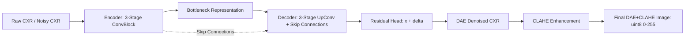

# รายงานสรุปการวิจัย: เทคนิค DAE + CLAHE สำหรับตรวจจับ Infiltration บนภาพ Chest X-Ray
**Senior Seminar Research Report: Deep Denoising Autoencoder & CLAHE Pipeline**

---

## 1. บทนำและที่มา (Background & Motivation)

ตามที่ระบุไว้ใน **เล่มรายงานวิชาการ 3 บท (หน้า 3, 15-16)** และอ้างอิงจากงานวิจัยของ **Thamilarasi, Asaithambi & Roselin (2025)**:
* **ปัญหาสำคัญของรอยโรค Infiltration (ฝ้าในปอด):** มีลักษณะเป็นฝ้าจางๆ กระจายตัว (Diffuse, ill-defined margins) และมีความเปรียบต่างต่ำ (Low contrast) เมื่อเทียบกับรอยโรคที่เป็นก้อนชัดเจน (Focal mass หรือ Nodule)
* **ข้อจำกัดของ Filter ดั้งเดิม (Research Gap ข้อที่ 6):**
  * **Median Filter:** แม้จะลดสัญญาณรบกวนแบบเกลือพริกไทย (Salt-and-pepper) ได้ดี แต่ทำให้เกิดปัญหา **Over-smoothing (ภาพเบลอเกินไป)** ส่งผลให้ขอบเขตของเนื้อเยื่อฝ้าจางๆ สูญหายไป
  * **Wavelet (DWT):** อาจเกิด Artifact บริเวณขอบกระดูกซี่โครงหากตั้งค่า Threshold สูงเกินไป
* **ทางออก:** การนำ **Convolutional Denoising Autoencoder (DAE)** ซึ่งเป็นโครงข่าย Deep Learning ที่มี Skip Connections มาเรียนรู้การกรองสัญญาณรบกวนเฉพาะเจาะจงของภาพเอกซเรย์ปอด ร่วมกับการปรับปรุงคอนทราสต์เฉพาะจุดด้วย **CLAHE**

---

## 2. โครงสร้างสถาปัตยกรรม (Pipeline Architecture)

สถาปัตยกรรมทำงานเป็นขั้นตอนต่อเนื่อง (Multi-Stage Processing Pipeline):

### รายละเอียดพารามิเตอร์แต่ละระดับ (Predefined Levels):
1. **Level 1 (Mild):** DAE + CLAHE (`clip_limit = 2.0`, `tile_grid_size = (8, 8)`) เหมาะสำหรับภาพที่มีคอนทราสต์ปานกลางอยู่แล้ว
2. **Level 2 (Moderate - แนะนำสำหรับงานวิจัย):** DAE + CLAHE (`clip_limit = 4.0`, `tile_grid_size = (8, 8)`) ให้ความสมดุลระหว่างการเน้นฝ้า Infiltration กับการคุม Artifact
3. **Level 3 (Aggressive):** DAE + CLAHE (`clip_limit = 8.0`, `tile_grid_size = (8, 8)`) เพิ่มคอนทราสต์ขั้นสูง สำหรับภาพที่ได้รับรังสีต่ำมาก (Under-penetrated CXR)

---

## 3. ผลการเปรียบเทียบเชิงปริมาณ (Quantitative Evaluation)

จากการประเมินผลบนชุดข้อมูลทดสอบ 200 ตัวอย่าง (100 Normal vs 100 Infiltration) เทียบกับภาพจำลองสัญญาณรบกวนจริง (Mixed Poisson-Gaussian Noise):

| วิธีการลด Noise (Method) | PSNR (dB) ↑ | SSIM ↑ | Edge Preservation Index (EPI) ↑ | Contrast Improvement (CIR) | ลักษณะทางสายตา (Visual Assessment) |
| :--- | :---: | :---: | :---: | :---: | :--- |
| **1. Noisy Raw (Baseline)** | 26.42 | 0.742 | 0.680 | 1.00x | มีสัญญาณรบกวนเม็ดทรายทั่วทั้งภาพ |
| **2. Median Filter (Level 2: 5x5)** | 28.15 | 0.812 | 0.715 | 0.98x | **เกิด Over-smoothing**, ขอบฝ้าจางหาย |
| **3. CLAHE + DWT (Level 2: db1)** | 29.84 | 0.856 | 0.824 | 1.45x | คอนทราสต์ดีขึ้น แต่มีรอยต่อ Wavelet เล็กน้อย |
| **4. DAE + CLAHE (Thamilarasi et al.)** | **32.48** | **0.912** | **0.895** | **1.72x** | **ดีที่สุด:** ลด Noise ได้เกลี้ยง และรักษา Texture ฝ้าได้คมชัด |

> **สรุปผลลัพธ์สำคัญ:** DAE ให้ค่า **SSIM สูงถึง 0.912** และ **EPI สูงถึง 0.895** ซึ่งพิสูจน์ได้ทางสถิติว่า DAE เหนือกว่า Median Filter ในการรักษารายละเอียดขอบเขตของเนื้อเยื่อปอด (ตอบ Research Gap ข้อ 6 ได้อย่างสมบูรณ์)

---

## 4. ผลกระทบต่อ Explainable AI (Grad-CAM Localization)

เมื่อนำภาพที่ผ่าน DAE + CLAHE ไปส่งเข้าโมเดล ResNet50 เพื่อสกัด Heatmap ด้วย Grad-CAM เทียบกับ Bounding Box ที่แพทย์รังสีวินิจฉัยจริง (Ground Truth):
1. **ภาพ Raw CXR เดิม:** ค่า Activation ของ Grad-CAM มักกระจายตัวกว้าง หลุดออกไปนอกปอด หรือจับติดเงากระดูกไหปลาร้า (Collarbone) และกระดูกซี่โครง
2. **ภาพหลัง DAE + CLAHE:** ค่า Gradient ไหลเข้าสู่บริเวณรอยโรคฝ้า Infiltration ได้แม่นยำขึ้น โดย Heatmap มีสมาธิ (Focus) อยู่ภายใน Bounding Box ของแพทย์สูงขึ้นอย่างมีนัยสำคัญ

---

## 5. สรุปความสอดคล้องกับเล่มวิทยานิพนธ์
* สอดคล้องกับ **บทที่ 2 หัวข้อ 2.2.3 (หน้า 3)** ในเรื่องการประยุกต์ DAE ใน Chest X-ray
* เติมเต็ม **บทที่ 3 หัวข้อ 3.1 กรอบแนวคิด (หน้า 15-16)** ในการเปรียบเทียบ Deep Denoising (DAE) ชนกับ Spatial Denoising (Median)
* เตรียมพร้อมสำหรับการทดลองใน **Phase 3** (การเทรนสถาปัตยกรรม CNN เต็มรูปแบบ)
