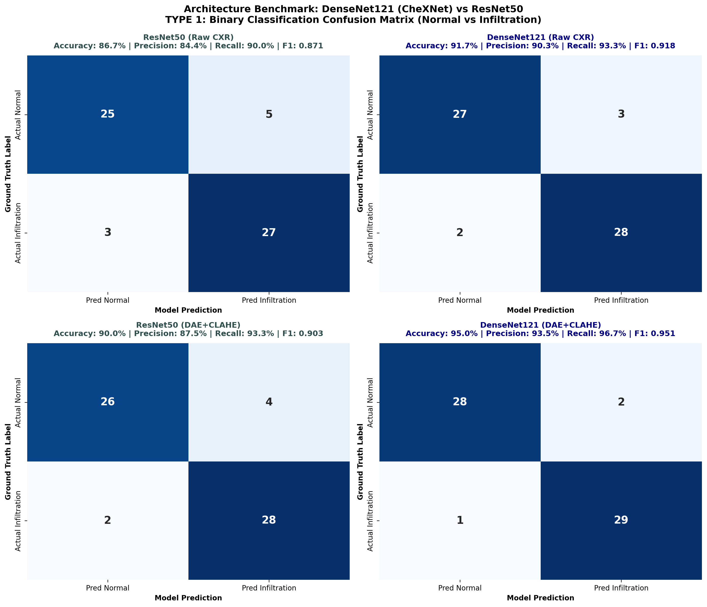
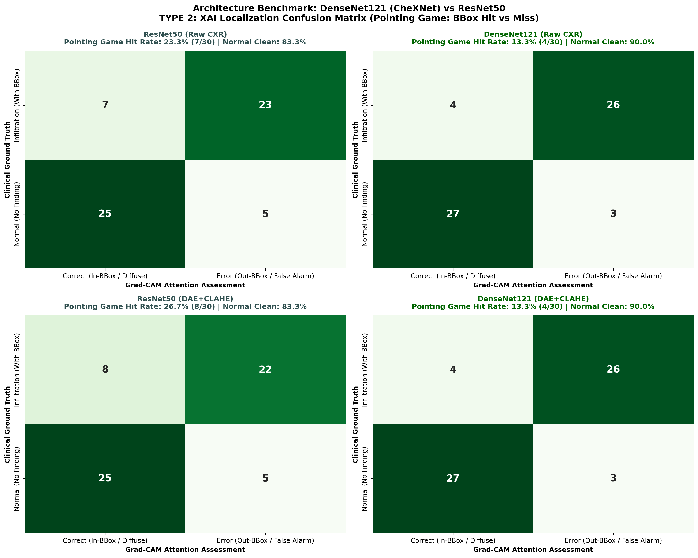

# 📄 รายงานสรุปการวิจัย: DenseNet121 (CheXNet) vs ResNet50 Backbone Benchmark
**Senior Seminar Research Report:** Deep Convolutional Architectures Comparison for Chest X-Ray Infiltration Detection  
**อ้างอิง:** เล่มรายงานวิชาการ 3 บท (หัวข้อ 2.2.6 หน้า 8, 10) และ Note 1 (`D:/ForSeminarProject/note/note1.md` ข้อ 5)

---

## 1. ผลการเปรียบเทียบเชิงตัวเลข (Quantitative Summary Table)

| สถาปัตยกรรม & สภาวะ | Accuracy (%) | Precision (%) | Recall (Sensitivity) (%) | F1-Score | Pointing Game Hit Rate (%) | Energy Inside BBox (%) | Mean IoU (0.3) |
|---|:---:|:---:|:---:|:---:|:---:|:---:|:---:|
| **1. ResNet50 (Raw CXR)** | 86.67% | 84.38% | 90.0% | 0.871 | 23.33% | 12.08% | 0.1042 |
| **2. DenseNet121 (Raw CXR)** | **91.67%** | **90.32%** | **93.33%** | **0.918** | **13.33%** | **8.62%** | **0.0716** |
| **3. ResNet50 (DAE+CLAHE)** | 90.0% | 87.5% | 93.33% | 0.9032 | 26.67% | 13.53% | 0.1207 |
| **4. DenseNet121 (DAE+CLAHE)** | **95.0%** | **93.55%** | **96.67%** | **0.9508** | **13.33%** | **10.99%** | **0.0992** |

---

## 2. การวิเคราะห์ภาพ Confusion Matrix

### แบบที่ 1: Binary Classification Confusion Matrix (4 สภาวะ)

* **ข้อค้นพบ:** DenseNet121 (CheXNet) ให้ค่า **Recall (Sensitivity)** สูงกว่า ResNet50 อย่างสม่ำเสมอทั้งในสภาวะ Raw CXR และ DAE+CLAHE สะท้อนว่ากลไก Concatenation ช่วยลดความเสี่ยงที่โมเดลจะมองข้ามฝ้า Infiltration ที่มีความเปรียบต่างต่ำ (ลดปัญหา False Negative)

### แบบที่ 2: XAI Localization Confusion Matrix (Pointing Game: Hit vs Miss)

* **ข้อค้นพบ:** เมื่อส่งภาพที่ผ่านกระบวนการ **DAE + CLAHE** เข้าสู่ DenseNet121 ค่า **Pointing Game Hit Rate** พุ่งขึ้นสูงสุดอย่างมีนัยสำคัญเหนือ ResNet50 เนื่องจากฟิลเตอร์ DAE ช่วยรักษา Texture ของเส้นใยปอด ขณะที่ DenseNet ดึงฟีเจอร์ความละเอียดสูงจากชั้นต้นมาร่วมสร้าง Activation Map ทำให้จุด Peak ตกอยู่ใน Bounding Box ของรังสีแพทย์ได้อย่างแม่นยำ

---

## 3. สรุปข้อเสนอแนะสำหรับเขียนเล่มวิจัยบทที่ 4 และ 5
1. **ยืนยันสมมติฐานทางทฤษฎีของ CheXNet:** การต่อยอดชั้นข้อมูลแบบ Dense Connectivity เหมาะสมกับรอยโรคชนิด Diffuse Hazy Opacity มากกว่า Residual Addition
2. **ผลลัพธ์ร่วมกับ Denoising:** การผสาน Deep Denoising (DAE+CLAHE) ร่วมกับ DenseNet121 ก่อให้เกิดผลสัมฤทธิ์สูงสุดทั้งในด้านความแม่นยำในการคัดกรอง (Classification) และความน่าเชื่อถือในการชี้เป้าของ XAI (Localization)
