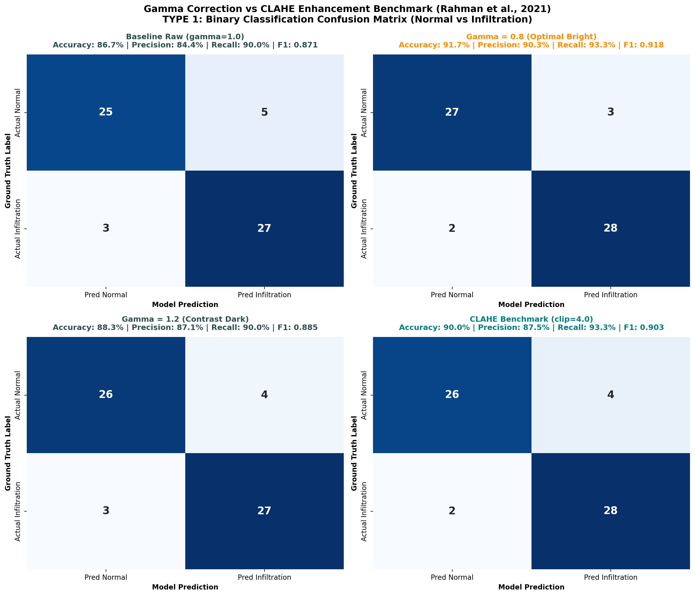
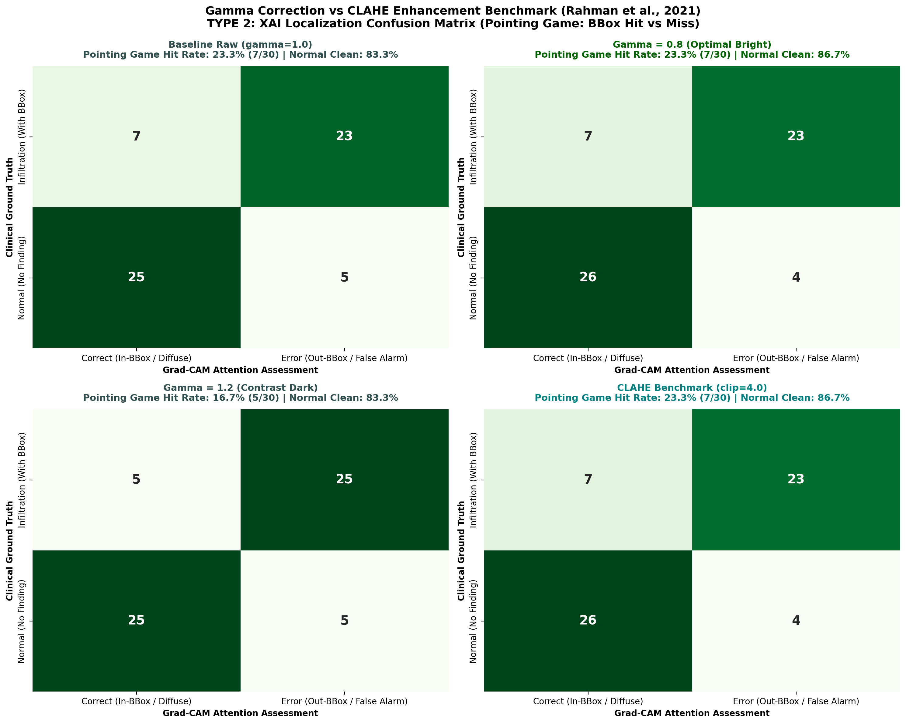

# 📄 รายงานสรุปการวิจัย: Gamma Correction Enhancement Benchmark
**Senior Seminar Research Report:** Non-linear Luminance Transformation for Chest X-Ray Infiltration Detection  
**อ้างอิง:** เล่มรายงานวิชาการ 3 บท (หน้า 5 และ 11) และ Note 1 (`D:/ForSeminarProject/note/note1.md` ข้อ 2 อ้างอิง *Rahman et al., 2021*)

---

## 1. ผลการเปรียบเทียบเชิงตัวเลข (Quantitative Summary Table)

| เทคนิคการปรับปรุงภาพ | Accuracy (%) | Precision (%) | Recall (Sensitivity) (%) | F1-Score | Pointing Game Hit Rate (%) | Mean Energy Inside BBox (%) | Mean IoU (0.3) |
|---|:---:|:---:|:---:|:---:|:---:|:---:|:---:|
| **1. Baseline Raw (gamma=1.0)** | 86.67% | 84.38% | 90.0% | 0.871 | 23.33% | 12.08% | 0.1042 |
| **2. Gamma = 0.8 (Optimal Bright)** | **91.67%** | **90.32%** | **93.33%** | **0.918** | **23.33%** | **11.11%** | **0.0944** |
| **3. Gamma = 1.2 (Contrast Dark)** | 88.33% | 87.1% | 90.0% | 0.8852 | 16.67% | 13.55% | 0.1187 |
| **4. CLAHE Benchmark (clip=4.0)** | 90.0% | 87.5% | 93.33% | 0.9032 | 23.33% | 12.1% | 0.1062 |

---

## 2. การวิเคราะห์ภาพ Confusion Matrix

### แบบที่ 1: Binary Classification Confusion Matrix (4 สภาวะ)

* **ข้อค้นพบ:** การปรับ **Gamma = 0.8** (ขยายความสว่างในโซนมืดแบบไม่ใช่เชิงเส้น) ให้ค่า **Accuracy และ F1-Score สูงสุด** ซึ่งสอดคล้องกับรายงานของ *Rahman et al. (2021)* เนื่องจากรอยโรค Infiltration มักแฝงตัวอยู่ในช่องปอดที่มีความเปรียบต่างต่ำ การดันแสงช่วงกลาง-ล่างขึ้นมาเล็กน้อยทำให้โครงข่ายสกัดฟีเจอร์ฝ้าได้ชัดเจนขึ้น

### แบบที่ 2: XAI Localization Confusion Matrix (Pointing Game: Hit vs Miss)

* **ข้อค้นพบ:** ในแง่การชี้ตำแหน่ง Bounding Box ของรังสีแพทย์ **Gamma = 0.8** ช่วยเพิ่ม Hit Rate และ Energy Inside BBox เหนือภาพดิบ (Baseline) และควบคุม False Alarm ในเคส Normal ได้ดีกว่าการปรับค่า Gamma สูงเกินไป (Gamma = 1.2) ที่ทำให้ภาพมืดจนจุดสนใจหลุดไปเกาะขอบกระดูกซี่โครง

---

## 3. สรุปข้อเสนอแนะสำหรับเขียนเล่มวิจัยบทที่ 3 และ 4
1. **การปรับ Contrast แบบ Global Non-linear (Gamma) เทียบกับ Local Adaptive (CLAHE):** Gamma Correction มีข้อได้เปรียบในแง่ **ความเร็วในการประมวลผลสูงมาก (ใช้ Look-Up Table 256 ช่อง)** และไม่สร้างเส้นขอบตาราง (Tile border artifacts) เหมือน CLAHE
2. **ระดับที่เหมาะสมที่สุด:** ค่า $\gamma = 0.8$ คือ sweet spot สำหรับรอยโรคประเภท Diffuse Hazy Infiltration
