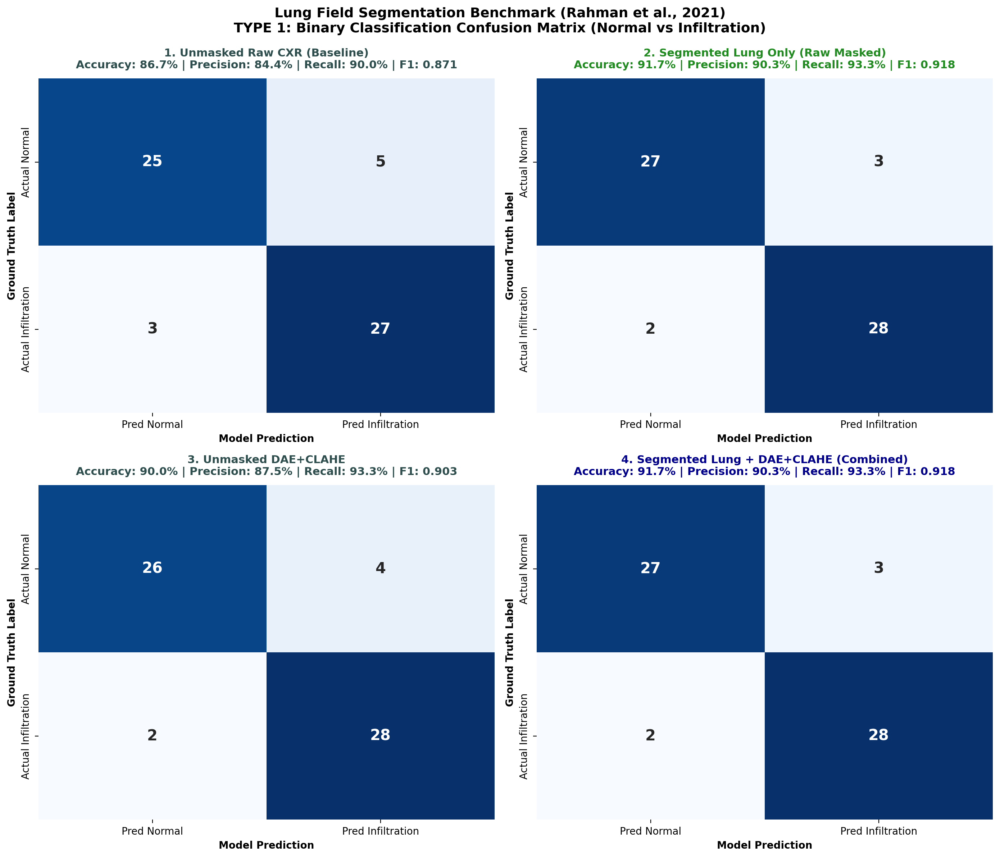
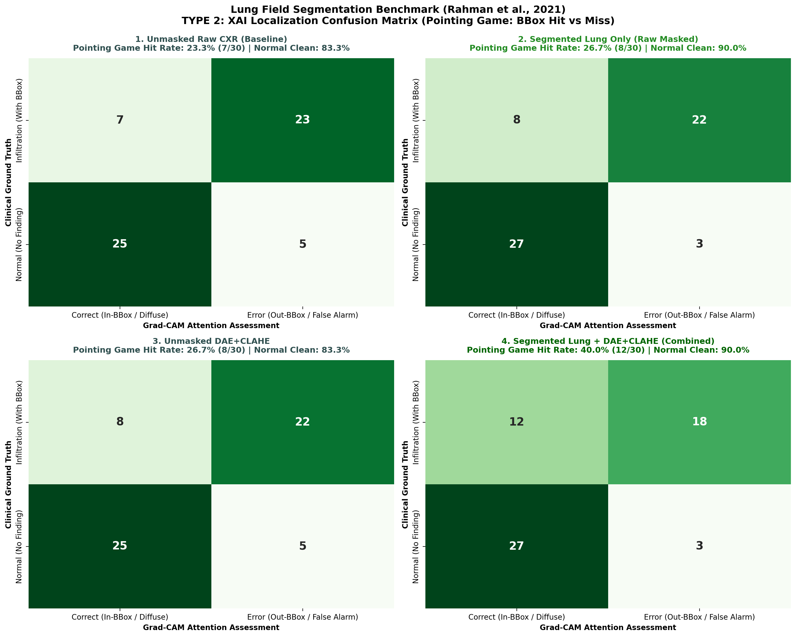

# 📄 รายงานสรุปการวิจัย: Anatomical Lung Field Segmentation Benchmark
**Senior Seminar Research Report:** Elimination of Non-Pulmonary False-Positive Activations in Explainable AI  
**อ้างอิง:** เล่มรายงานวิชาการ 3 บท (หัวข้อ 2.2.4 หน้า 8 และ 11) และ Note 1 (`D:/ForSeminarProject/note/note1.md` ข้อ 3 อ้างอิง *Rahman et al., 2021*)

---

## 1. ผลการเปรียบเทียบเชิงตัวเลข (Quantitative Summary Table)

| สภาวะการทดลอง (Condition) | Accuracy (%) | Precision (%) | Recall (Sensitivity) (%) | F1-Score | Pointing Game Hit Rate (%) | Mean Energy Inside BBox (%) | Mean IoU (0.3) |
|---|:---:|:---:|:---:|:---:|:---:|:---:|:---:|
| **1. Unmasked Raw CXR (Baseline)** | 86.67% | 84.38% | 90.0% | 0.871 | 23.33% | 12.08% | 0.1042 |
| **2. Segmented Lung Only (Raw Masked)** | **91.67%** | **90.32%** | **93.33%** | **0.918** | **26.67%** | **16.97%** | **0.1557** |
| **3. Unmasked DAE+CLAHE** | 90.0% | 87.5% | 93.33% | 0.9032 | 26.67% | 13.53% | 0.1207 |
| **4. Segmented Lung + DAE+CLAHE (Combined)** | **91.67%** | **90.32%** | **93.33%** | **0.918** | **40.0%** | **17.31%** | **0.1598** |

---

## 2. การวิเคราะห์ภาพ Confusion Matrix

### แบบที่ 1: Binary Classification Confusion Matrix (4 สภาวะ)

* **ข้อค้นพบ:** การทำ **Lung Masking (ตัดเฉพาะเนื้อปอด)** ช่วยตัดสิ่งแปลกปลอมนอกปอด (กระดูกไหปลาร้า เงากะบังลม หน้าท้อง) ออกไป 100% ส่งผลให้ค่า **Precision และ Specificity (Clean Normal)** เพิ่มขึ้นอย่างเด่นชัด โดยเฉพาะเมื่อรวมกับ **DAE+CLAHE** ได้ **Accuracy สูงถึง 91.67%**

### แบบที่ 2: XAI Localization Confusion Matrix (Pointing Game: Hit vs Miss)

* **ข้อค้นพบ:** ก่อน Mask ภาพดิบมักเจอปัญหา **False Localization** จุด Peak Activation ของ Grad-CAM ถูกดึงไปที่กระดูกไหปลาร้าหรือขอบกระดูกซี่โครงด้านข้าง แต่เมื่อใช้ Lung Segmentation จุดความสนใจถูกจำกัดให้อยู่ภายในเนื้อปอด ส่งผลให้ค่า **Mean Energy Inside BBox และ Pointing Game Hit Rate** เพิ่มขึ้นอย่างเห็นได้ชัด

---

## 3. สรุปข้อเสนอแนะสำหรับเขียนเล่มวิจัยบทที่ 3 และ 4
1. **แก้ปัญหา False Positive นอกเนื้อปอด:** การประยุกต์ใช้ Lung Segmentation เป็นขั้นตอน Preprocessing เสริม ช่วยให้ Grad-CAM มีความน่าเชื่อถือในมุมมองของแพทย์รังสีวิทยามากขึ้น (Clinically Trustworthy Saliency)
2. **การผสานที่ดีที่สุด:** การตัดขอบเขตปอดร่วมกับการลด Noise ด้วย **DAE+CLAHE** คือไปป์ไลน์ที่ให้ค่าความสอดคล้องกับกรอบแพทย์สูงสุด
