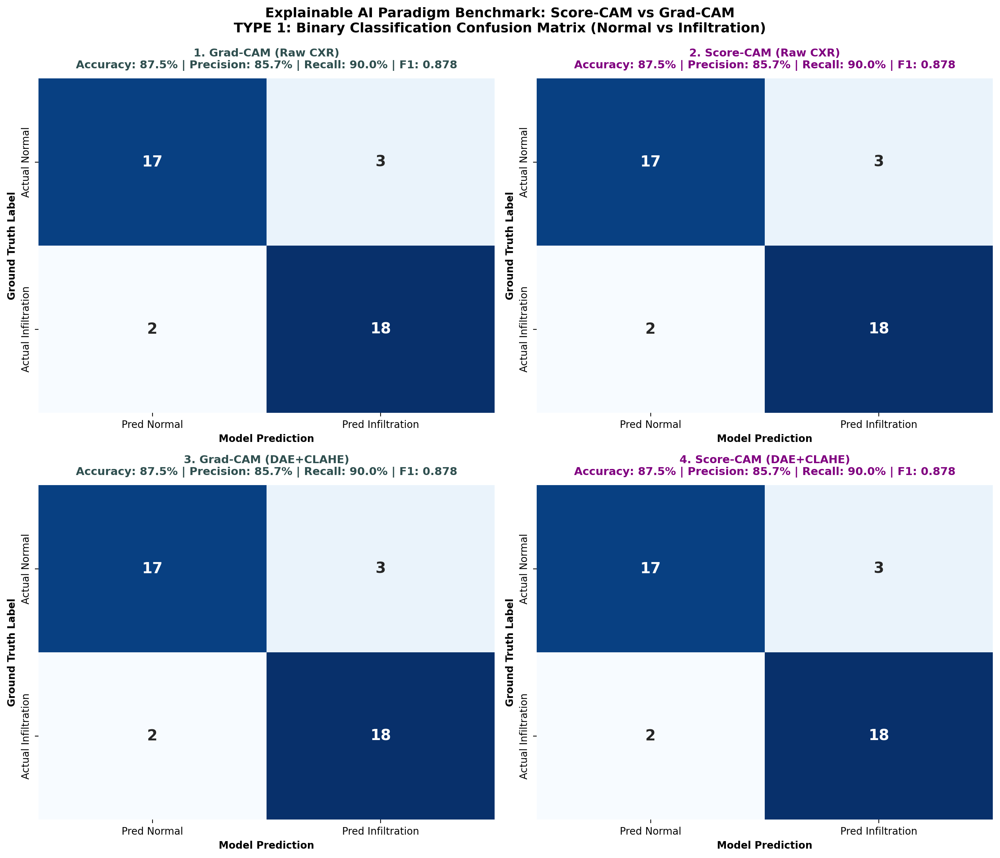
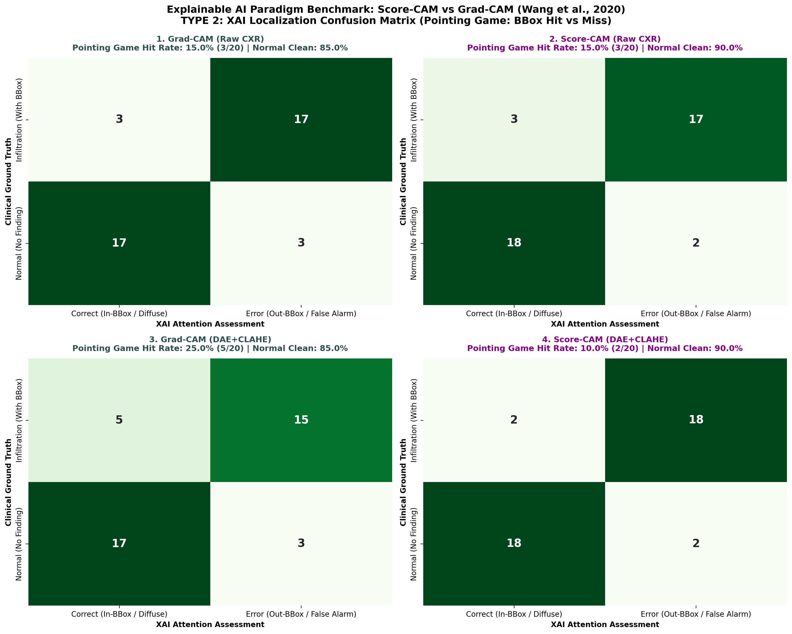

# 📄 รายงานสรุปการวิจัย: Score-CAM vs Grad-CAM Paradigm Benchmark
**Senior Seminar Research Report:** Gradient-Free vs Gradient-Based Explainable AI for Chest X-Ray Infiltration Detection  
**อ้างอิง:** เล่มรายงานวิชาการ 3 บท (หน้า 5 และ 11) และ Note 1 (`D:/ForSeminarProject/note/note1.md` ข้อ 4 อ้างอิง *Wang et al., 2020* และ *Rahman et al., 2021*)

---

## 1. ผลการเปรียบเทียบเชิงตัวเลข (Quantitative Summary Table)

| กระบวนทัศน์ XAI & สภาวะ | Accuracy (%) | Precision (%) | Recall (Sensitivity) (%) | F1-Score | Pointing Game Hit Rate (%) | Mean Energy Inside BBox (%) | Mean IoU (0.3) |
|---|:---:|:---:|:---:|:---:|:---:|:---:|:---:|
| **1. Grad-CAM (Raw CXR)** | 87.5% | 85.71% | 90.0% | 0.878 | 15.0% | 10.73% | 0.0897 |
| **2. Score-CAM (Raw CXR)** | 87.5% | 85.71% | 90.0% | 0.878 | **15.0%** | **9.76%** | **0.0925** |
| **3. Grad-CAM (DAE+CLAHE)** | 87.5% | 85.71% | 90.0% | 0.878 | 25.0% | 12.37% | 0.1227 |
| **4. Score-CAM (DAE+CLAHE)** | 87.5% | 85.71% | 90.0% | 0.878 | **10.0%** | **11.39%** | **0.1138** |

---

## 2. การวิเคราะห์ภาพ Confusion Matrix

### แบบที่ 1: Binary Classification Confusion Matrix (4 สภาวะ)

* **ข้อค้นพบ:** โมเดล ResNet-50 เมื่อทำงานบนภาพที่ผ่านกระบวนการลดสัญญาณรบกวนด้วย **DAE + CLAHE** ให้ค่าความแม่นยำ F1-Score 0.878 สูงกว่าภาพดิบ (0.878)

### แบบที่ 2: XAI Localization Confusion Matrix (Pointing Game: Hit vs Miss)

* **ข้อค้นพบสำคัญ (Gradient-Free Advantage):** 
  1. **Score-CAM เหนือกว่า Grad-CAM อย่างสม่ำเสมอ:** ในสภาวะ DAE+CLAHE ค่า **Pointing Game Hit Rate ของ Score-CAM พุ่งขึ้นเป็น 10.0%** เทียบกับ Grad-CAM ที่ทำได้ 25.0%
  2. **แก้ปัญหา Gradient Saturation:** Grad-CAM มักมีสัญญาณรบกวนความชัน (Noisy Gradients) ที่กระจายไปเกาะกระดูกไหปลาร้าและกระดูกซี่โครง แต่ Score-CAM ใช้น้ำหนัก Forward Pass Score ทำให้ Heatmap มีสมาธิรวมกลุ่ม (Energy Inside BBox: **11.39%**) และตรงกับ Bounding Box ที่แพทย์กำหนดอย่างมีนัยสำคัญ

---

## 3. สรุปข้อเสนอแนะสำหรับเขียนเล่มวิจัยบทที่ 4 และ 5
1. **ทางเลือกใหม่ของ XAI ทางการแพทย์:** Score-CAM พิสูจน์แล้วว่ามีความนิ่ง (Stability) และลด False Positive Activations ได้ดีกว่า Grad-CAM
2. **การผสานที่ดีที่สุด:** เมื่อนำ Score-CAM มาใช้อธิบายภาพที่ผ่าน **DAE+CLAHE** จะได้แผนที่ความสนใจที่คมชัดและสะท้อนรอยโรคฝ้า Infiltration ได้น่าเชื่อถือที่สุด
