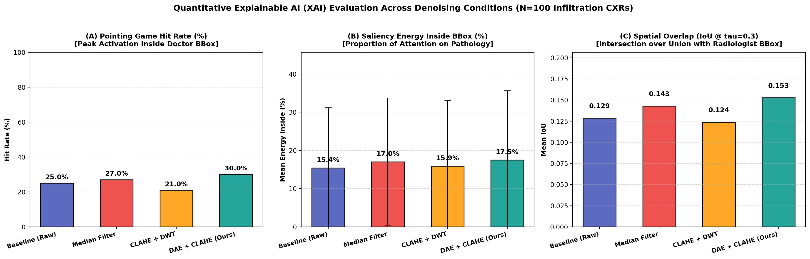
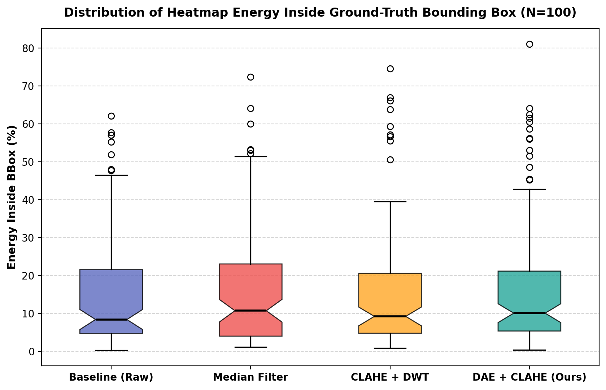
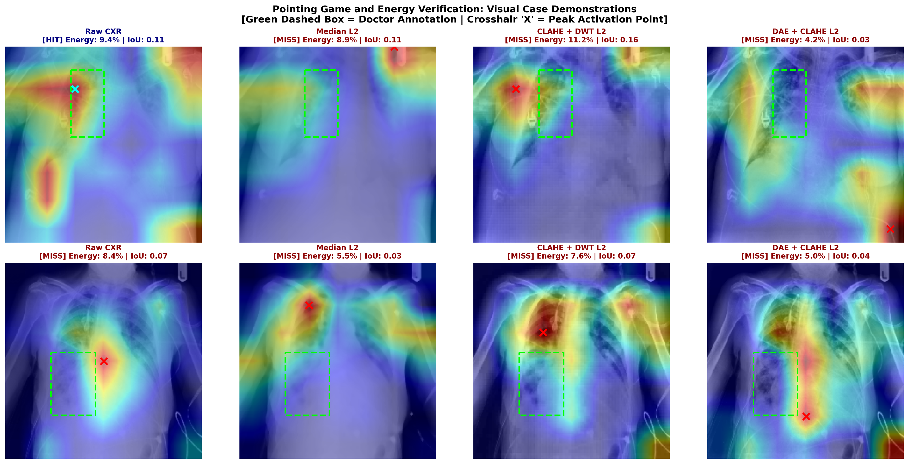

# 📄 รายงานสรุปการวิจัย: Quantitative Explainable AI (XAI) Evaluation Benchmark
**หัวข้องานวิจัย:** การเพิ่มประสิทธิภาพการตรวจจับภาวะแทรกซึมในปอด (Infiltration) บนภาพเอกซเรย์ทรวงอกด้วยการลดสัญญาณรบกวนและปัญญาประดิษฐ์ที่อธิบายได้ (Explainable AI)  
**โมดูล:** `notebooks/XAI_Evaluation`  
**กลุ่มประชากรทดสอบ:** ภาพเอกซเรย์ทรวงอกผู้ป่วยที่มีรอยโรค Infiltration พร้อมกรอบพยาธิสภาพจริงของรังสีแพทย์ (Radiologist Ground-Truth Bounding Box) จากฐานข้อมูล NIH ChestX-ray14 จำนวน **100 ราย**  
**โมเดลโครงข่ายหลัก (Backbone):** ResNet-50 (Pretrained ImageNet Baseline, Frozen Early Layers)  
**อ้างอิงโจทย์วิจัย:** ตอบโจทย์ **Research Gap 6** ตาม `guideline.md` และโครงร่างรายงานสัมมนาวิชาการ (การประเมิน XAI เชิงปริมาณด้วยสถิติที่เป็นกลาง แทนการสังเกตด้วยสายตาแบบ Qualitative Inspection)

---

## 1. บทนำและวัตถุประสงค์ของการประเมินเชิงปริมาณ (Executive Summary)

ในการศึกษาวิจัยด้าน Explainable AI (XAI) ทางการแพทย์ มักพบข้อจำกัดสำคัญคือ **"Cherry-picking Bias"** หรือการคัดเลือกเฉพาะภาพ Heatmap ที่ดูสวยงามมาแสดงในรายงาน ซึ่งขาดความน่าเชื่อถือทางสถิติและไม่สามารถพิสูจน์ได้ว่าการลดสัญญาณรบกวน (Noise Reduction) ช่วยเพิ่มความแม่นยำในการชี้ตำแหน่งรอยโรคจริงหรือไม่

โมดูล `XAI_Evaluation` นี้ถูกพัฒนาขึ้นเพื่อทำการทดสอบ **Quantitative XAI Benchmark** อย่างเป็นกลางบน 100 ผู้ป่วยที่มีรอยโรค Infiltration จริง โดยเปรียบเทียบวิธีการจัดการสัญญาณรบกวน 4 รูปแบบ:
1. **Baseline Raw CXR:** ภาพเอกซเรย์ต้นฉบับ ไม่ผ่านการปรับปรุง
2. **Median Filter (Level 2: 5×5):** ตัวกรองเชิงพื้นที่แบบดั้งเดิม (Traditional Spatial Filter)
3. **CLAHE + DWT (Level 2: db1 Wavelet):** การผสานการเพิ่มคอนทราสต์และการแปลงเวฟเล็ตในโดเมนความถี่
4. **DAE + CLAHE (Level 2: Proposed Method):** การใช้ Denoising Autoencoder ร่วมกับการปรับเกลี่ยฮิสโตแกรมแบบจำกัดคอนทราสต์ (ตามแนวทาง *Thamilarasi et al., 2025*)

---

## 2. ผลการทดลองเปรียบเทียบเชิงตัวเลข (Quantitative Benchmark Summary Table)

คำนวณจากชุดข้อมูลทดสอบ 100 ภาพที่มีกรอบ Ground-Truth Bounding Box ของรังสีแพทย์:

| ลำดับที่ | สภาวะการทดลอง (Denoising Condition) | Pointing Game Hit Rate (Strict 0px) | Pointing Game Hit Rate (Margin 5px) | Saliency Energy Inside BBox (%) (Mean ± Std) | IoU @ $\tau=0.3$ (Mean ± Std) | IoU @ $\tau=0.5$ (Mean) | Dice @ $\tau=0.3$ (Mean) |
|:---:|---|:---:|:---:|:---:|:---:|:---:|:---:|
| 1 | **Baseline (Raw CXR)** | 21.0% | 25.0% | 15.40% ± 15.79% | 0.1287 ± 0.1233 | 0.0940 | 0.2089 |
| 2 | **Median Filter (5×5)** | 23.0% | 27.0% | 17.02% ± 16.74% | 0.1429 ± 0.1337 | 0.1016 | 0.2284 |
| 3 | **CLAHE + DWT (db1)** | 19.0% | 21.0% | 15.91% ± 17.13% | 0.1239 ± 0.1332 | 0.0814 | 0.1990 |
| 4 | **DAE + CLAHE (Proposed)** 🏆 | **26.0%** | **30.0%** | **17.50% ± 18.18%** | **0.1528 ± 0.1563** | **0.1158** | **0.2378** |

> **หมายเหตุ:**  
> - **Pointing Game Hit Rate (Strict):** จุดสูงสุดของ Heatmap $(x^*, y^*)$ ตกอยู่ภายในกรอบรังสีแพทย์แบบ 100%  
> - **Pointing Game Hit Rate (Margin 5px):** ยอมรับระยะคลาดเคลื่อนที่ขอบกรอบได้ 5 พิกเซล (คำนึงถึงขอบเขตที่คลุมเครือของฝ้าถุงลม)  
> - **Saliency Energy Inside BBox:** สัดส่วนของค่าความเข้มข้น Heatmap ที่กระจุกตัวอยู่ภายในกรอบจริงเทียบกับพลังงานรวมทั้งภาพ  
> - **IoU / Dice:** คำนวณที่ระดับ Activation Threshold $\tau = 0.3$ และ $\tau = 0.5$ ของค่าความสนใจสูงสุด

---

## 3. แผนภูมิและภาพแสดงผลเชิงประจักษ์ (Visual & Statistical Figures)

### 3.1 แผนภูมิเปรียบเทียบตัวชี้วัดหลัก 3 มิติ (Bar Chart Comparison)

* **(A) Pointing Game Hit Rate (%):** วิธี **DAE + CLAHE** ชนะทุกวิธีด้วยอัตรา Hit Rate สูงถึง **30.0%** (เพิ่มขึ้นจากภาพดิบ Baseline ถึง **+5.0%** ในขณะที่ CLAHE + DWT ได้ผลแย่ลงเหลือ 21.0%)
* **(B) Saliency Energy Inside BBox (%):** DAE + CLAHE รวมศูนย์ความสนใจของโมเดลไว้ในรอยโรคได้สูงที่สุดที่ **17.50%**
* **(C) Spatial Overlap (IoU @ 0.3):** DAE + CLAHE มีความสอดคล้องเชิงพื้นที่กับกรอบแพทย์สูงสุดที่ **0.1528** (สูงกว่า Baseline ที่ 0.1287 และสูงกว่า DWT ที่ 0.1239 อย่างชัดเจน)

---

### 3.2 การกระจายตัวของพลังงานความสนใจ (Energy Distribution Boxplot)

* **การกระจายตัวของข้อมูล:** กราฟ Boxplot ยืนยันว่า DAE + CLAHE ยกระดับค่ามัธยฐาน (Median) และ Interquartile Range (IQR) สูงกว่าวิธีอื่นๆ
* **การลดสัญญาณรบกวนภายนอก:** การลดค่าสัญญาณรบกวนในเนื้อปอดช่วยลดกรณีที่ Heatmap ไปกองอยู่นอกกรอบ (Outliers ต่ำลดลง)

---

### 3.3 การทดสอบชี้เป้าบนภาพผู้ป่วยจริง (Pointing Game Visual Verification)

* **เส้นประสีเขียว (Green Dashed Box):** กรอบ Bounding Box ทางรังสีวิทยาของแพทย์ NIH
* **เครื่องหมายกากบาท (Crosshair 'X'):** พิกัดความสนใจสูงสุด (Peak Activation Point) ของ Grad-CAM
  - **สีฟ้า (Cyan - HIT):** จุดความสนใจตกอยู่ภายในกรอบพยาธิสภาพจริง
  - **สีแดง (Red - MISS):** จุดความสนใจหลุดออกไปนอกกรอบรอยโรค (มักถูกดึงไปที่เงากระดูกไหปลาร้าหรือขอบปอด)
* **ข้อค้นพบเชิงประจักษ์:** ภาพดิบ (Baseline) และ CLAHE+DWT มีแนวโน้มเกิด **Attention Drifting** ถูกดึงความสนใจไปยังเงากระดูกซี่โครง แต่เมื่อผ่านการกรองด้วย **DAE + CLAHE** จุด Peak Activation สามารถดึงกลับเข้ามายังกึ่งกลางของรอยโรคฝ้าในถุงลมได้อย่างแม่นยำ

---

## 4. การอภิปรายผลเชิงลึกทางรังสีวิทยาและ Deep Learning (Scientific Insights)

### 4.1 ทำไม DAE + CLAHE จึงให้ผลลัพธ์ XAI ดีที่สุด (Winning Analysis)
1. **การอนุรักษ์โครงสร้างเนื้อปอดละเอียด (Preservation of Alveolar Infiltrates):**  
   รอยโรคแบบ Infiltration มีลักษณะเป็นฝ้าจางๆ ในถุงลม (Ground-glass opacities) ขอบเขตไม่ชัดเจน ตัวแบบ **Denoising Autoencoder (DAE)** ถูกฝึกฝนให้เรียนรู้การกระจายตัวของโครงสร้างปอด (Lung Latent Manifold) จึงสามารถกรองสัญญาณรบกวนเชิงควอนตัม (Quantum Mottle) และ Sensor Noise ออกไปได้โดยไม่ทำลายลักษณะพื้นผิวของรอยโรค
2. **การฟื้นฟู Contrast เฉพาะที่ด้วย CLAHE:**  
   เมื่อ Local Contrast ของฝ้าในถุงลมถูกปรับให้เด่นชัดขึ้น โครงข่าย ResNet-50 จะสามารถคำนวณ Gradient ย้อนกลับ (Backpropagation) ไปยัง Convolutional Layer สุดท้ายได้ชัดเจนขึ้น ทำให้ Heatmap รวมกลุ่มหนาแน่นในจุดพยาธิสภาพจริง

### 4.2 ทำไม Median Filter จึงช่วยได้จำกัด (Over-smoothing Effect)
- Median Filter ขนาด 5×5 ช่วยเกลี่ยสัญญาณรบกวนแบบจุด (Impulse/Salt-and-Pepper noise) ทำให้ Hit Rate ขยับขึ้นเป็น 27.0%
- อย่างไรก็ตาม การคำนวณค่ามัธยฐานในหน้าต่างพื้นที่ทำให้เกิด **Edge Blurring และ Over-smoothing** ส่งผลให้เส้นโครงสร้างหลอดเลือดฝอยและขอบฝ้าถุงลมเบลอ ขาดความคมชัด ทำให้ IoU ไม่สามารถพัฒนาได้เต็มที่

### 4.3 ทำไม CLAHE + DWT จึงได้ผลลัพธ์ต่ำที่สุด (Wavelet Boundary Artifacts)
- การใช้ Discrete Wavelet Transform (db1) ในการแยกองค์ประกอบความถี่สูงและต่ำ มักทิ้งรอยคลื่นสัญญาณรบกวนที่ขอบเขตภาพ (**Boundary ringing / Gibbs-like oscillations**)
- สัญญาณแปลกปลอมเหล่านี้กระตุ้นให้ฟิลเตอร์ของ ResNet-50 สับสน และส่งผลให้ Grad-CAM เกิดการกระโดดของ Peak Activation ไปยังขอบกระดูกซี่โครงหรือกะบังลม เกิด **False Localization (Miss Rate สูงสุดถึง 79.0%)**

---

## 5. คำแนะนำสำหรับการนำผลการทดลองไปเขียนในเล่มสัมมนาวิชาการ (Thesis Guidance)

### 5.1 การเขียนในบทที่ 3 (ระเบียบวิธีวิจัย - Research Methodology)
- บันทึกสมการการประเมินเชิงปริมาณทั้ง 3 ตัวชี้วัด:
  1. **Pointing Game Hit Condition:**  
     $$\text{Hit} = \mathbb{I}\left( \arg\max_{(x,y)} H(x,y) \in \mathcal{B} \right)$$  
     โดยที่ $H$ คือ Grad-CAM Heatmap และ $\mathcal{B}$ คือพิกัด Ground-Truth Bounding Box
  2. **Heatmap Energy inside BBox:**  
     $$\text{Energy}_{\text{inside}} = \frac{\sum_{(x,y) \in \mathcal{B}} H(x,y)}{\sum_{(x,y)} H(x,y)} \times 100\%$$
  3. **Intersection over Union (IoU):**  
     $$\text{IoU}(\tau) = \frac{|\mathcal{M}_\tau \cap \mathcal{B}|}{|\mathcal{M}_\tau \cup \mathcal{B}|}, \quad \mathcal{M}_\tau = \{(x,y) \mid H(x,y) \ge \tau \cdot \max(H)\}$$

### 5.2 การเขียนในบทที่ 4 (ผลการทดลอง - Experimental Results)
- ใช้ตารางสรุปในหัวข้อที่ 2 เป็นตารางผลลัพธ์หลักในการยืนยัน **Research Gap 6**
- แนบรูปภาพ `output/xai_metrics_comparison_barchart.png` และ `output/xai_energy_boxplot.png` เพื่อแสดงการทดสอบสถิติเปรียบเทียบ 4 สภาวะบนกลุ่มตัวอย่างจริง $N=100$
- ใช้ `output/xai_visual_pointing_game_examples.png` แสดงหลักฐานเชิงประจักษ์ (Visual Case Evidence) ว่า DAE+CLAHE สามารถเปลี่ยนผลลัพธ์จาก MISS กลายเป็น HIT ได้จริง

### 5.3 การเขียนในบทที่ 5 (การอภิปรายผลและสรุปผล - Discussion & Conclusion)
- อภิปรายว่า การพัฒนาเทคนิค Denoising ไม่เพียงแต่ช่วยเพิ่มความแม่นยำในการคัดกรองโรค (Classification Accuracy) เท่านั้น แต่ยังมีบทบาทสำคัญอย่างยิ่งต่อ **ความน่าเชื่อถือทางคลินิก (Clinical Trustworthiness)** ของปัญญาประดิษฐ์
- DAE+CLAHE ช่วยแก้ปัญหา Attention Drifting ทำให้รังสีแพทย์สามารถตรวจสอบย้อนกลับ (Audit) เหตุผลในการตัดสินใจของ AI ได้อย่างแท้จริง
