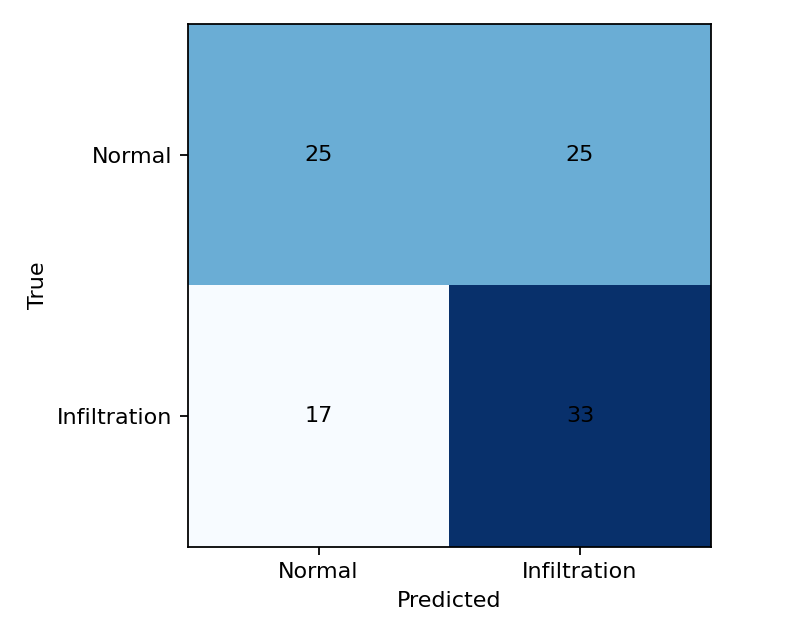
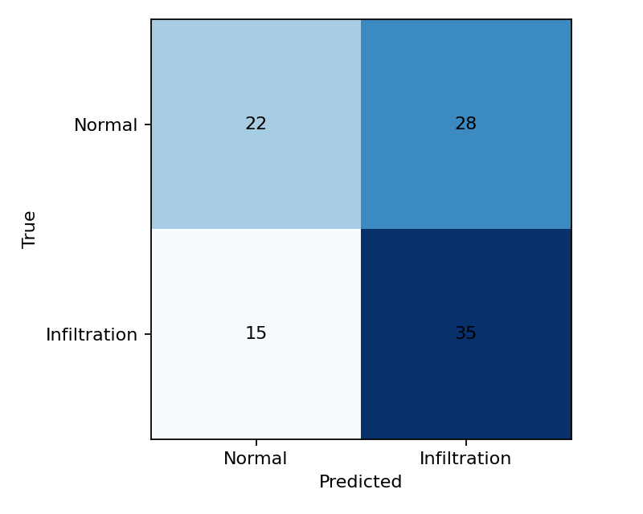

# สรุปผล CNN: Baseline, Median และ CLAHE+DWT

ผลจากไฟล์ `metrics.json` ในแต่ละโฟลเดอร์ภายใต้ `outputs/` นี้ เป็นการทดลองนำร่องเพื่อเปรียบเทียบวิธีเตรียมภาพก่อนจำแนก **Normal** กับ **Infiltration** ไม่ใช่การจำแนกสาเหตุของโรคหรือ COVID-19

## วิธีทดลอง

- โมเดล: ResNet50 น้ำหนักเริ่มต้นจาก ImageNet, freeze backbone และฝึกชั้นจำแนกด้านบน
- ภาพ: 224×224; seed 42; batch size 16; learning rate 0.0001
- จำนวนภาพต่อวิธี: ฝึก 320, validation 80, test 100 (Normal 50 / Infiltration 50 ใน test)
- แต่ละวิธีฝึกจริง **50 epochs** ตาม `epochs_run` ใน `metrics.json`
- `split_manifest.csv` ของทั้ง 7 วิธีตรงกันครบ 500 รายการ จึงใช้ภาพเดียวกันใน train/validation/test
- ระดับ Median: L1 = kernel 3, L2 = 5, L3 = 7
- ระดับ CLAHE+DWT: L1 = clip 2 / DWT depth 1 / threshold multiplier 0.5; L2 = 4 / 2 / 1.0; L3 = 8 / 3 / 2.0 ตามค่า preset ในขั้นเตรียมภาพ

## ผลบน test set

กำหนด Infiltration เป็น positive class; AUC คำนวณจากคะแนนความน่าจะเป็นก่อนตัดที่ 0.5

| วิธี | Accuracy | Precision | Recall | F1 | AUC | Δ Accuracy เทียบ Baseline |
|---|---:|---:|---:|---:|---:|---:|
| Baseline | 0.560 | 0.548 | 0.680 | 0.607 | 0.575 | — |
| Median L1 (3×3) | 0.560 | 0.548 | 0.680 | 0.607 | 0.572 | 0.000 |
| Median L2 (5×5) | 0.560 | 0.554 | 0.620 | 0.585 | 0.576 | 0.000 |
| Median L3 (7×7) | 0.570 | 0.561 | 0.640 | 0.598 | 0.568 | +0.010 |
| CLAHE+DWT L1 | 0.580 | 0.569 | 0.660 | 0.611 | 0.581 | +0.020 |
| CLAHE+DWT L2 | 0.570 | 0.556 | 0.700 | 0.619 | 0.614 | +0.010 |
| **CLAHE+DWT L3** | **0.600** | **0.583** | **0.700** | **0.636** | **0.642** | **+0.040** |

ในชุดนำร่องนี้ CLAHE+DWT L3 ให้คะแนนสูงสุดทั้ง Accuracy, F1 และ AUC: ทายถูก 60/100 ภาพ เทียบกับ Baseline ที่ 56/100 ภาพ แต่ความต่าง 4 ภาพบน test 100 ภาพยังไม่พอจะสรุปว่าเหนือกว่าอย่างแน่นอน ส่วน Median ทั้งสามระดับให้คะแนนใกล้เคียง Baseline

## Confusion matrix

ในภาพแต่ละใบ แถวคือคำตอบจริงและคอลัมน์คือคำทำนาย เรียง `Normal`, `Infiltration` ทั้งสองแกน

### Baseline

### Median

Median L1 (3×3)

Median L2 (5×5)

Median L3 (7×7)

### CLAHE+DWT

CLAHE+DWT L1

CLAHE+DWT L2

CLAHE+DWT L3

## การตีความและงานต่อไป

ผลทั้งหมดเป็น **pilot** จากภาพทดสอบ 100 ภาพ และคะแนน Accuracy 0.56–0.60 / AUC 0.568–0.642 ยังไม่รองรับการใช้วินิจฉัยหรือระบุตำแหน่งความผิดปกติจากภาพอย่างน่าเชื่อถือ การฝึก 50 epochs ไม่ได้แปลว่าโมเดลทั่วไปกับภาพใหม่ได้ดีขึ้น

CLAHE+DWT L1–L3 เปลี่ยน clip limit, DWT depth และ threshold พร้อมกัน จึงยังบอกไม่ได้ว่าปัจจัยใดทำให้ผลต่างกัน และระดับที่มากขึ้นอาจเพิ่ม contrast/artifact ไม่ใช่เพิ่มการลด noise อย่างเดียว หากต้องการตอบคำถามเรื่อง over-smoothing ตาม guideline ต้องตรวจภาพและวัด XAI กับ bbox แยกต่างหาก

ไฟล์ `test_predictions.csv` เก็บผลรายภาพสำหรับวิเคราะห์คู่เปรียบเทียบหรือคำนวณช่วงความเชื่อมั่นภายหลัง; `history.csv` เก็บค่าระหว่างฝึก; `confusion_matrix.png` เป็นภาพตารางสับสนของแต่ละวิธี ขณะนี้ยังไม่มีผล DAE+CLAHE, Grad-CAM, SHAP หรือ XAI-IoU ในโฟลเดอร์นี้
