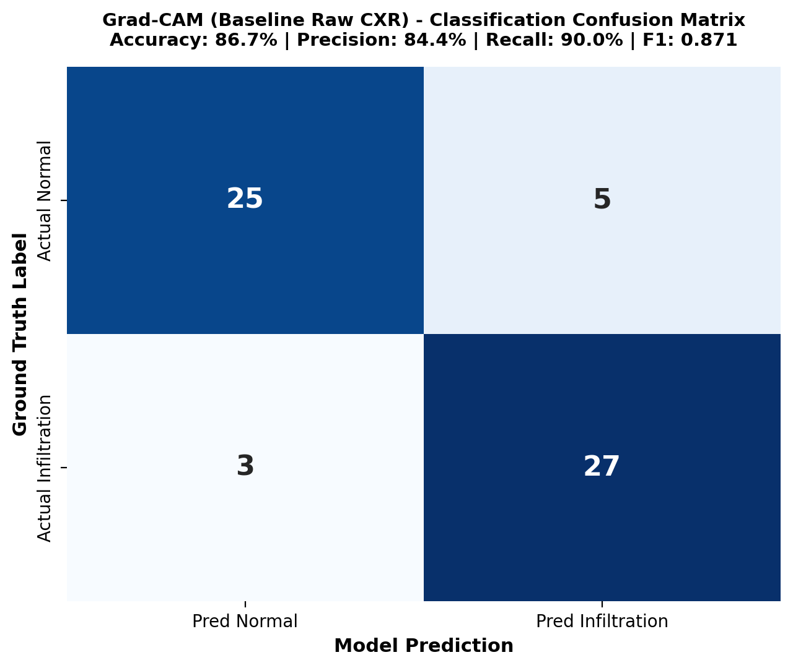
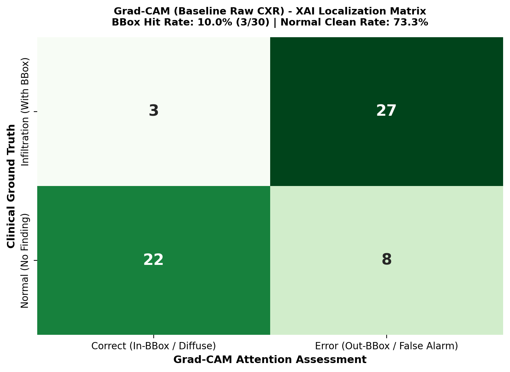

# 📄 รายงานสรุปผล Confusion Matrix: Grad-CAM Baseline (Raw CXR)
**Project Title:** Enhancing Chest X-RAY Infiltration Detection Using Noise Reduction and Explainable AI  
**โมดูล:** `notebooks/cnn_gradcam/Gradcam`  
**โมเดลที่ใช้:** ResNet-50 (Pretrained ImageNet Baseline บนภาพดิบ Raw CXR)

---

## 1. ผลการจำแนกประเภท (Classification Performance)
จากการทดสอบจำแนกภาพระหว่าง **Normal (ปอดปกติ)** และ **Infiltration (ฝ้าในปอด)** จำนวนรวม 60 ตัวอย่าง:

| ตัวชี้วัด (Metric) | ค่าที่ได้ (Baseline Raw CXR) |
|---|:---:|
| **Accuracy** | **86.7%** |
| **Precision** | **84.4%** |
| **Recall (Sensitivity)** | **90.0%** |
| **F1-Score** | **0.871** |

---

## 2. ผลการชี้ตำแหน่งด้วย Grad-CAM (XAI Localization Performance)
ประเมินความสอดคล้องระหว่างจุดสูงสุดของ Grad-CAM Heatmap (Peak Activation) กับกรอบ Bounding Box ของรังสีแพทย์ NIH (Pointing Game Protocol):

| การประเมิน | ผลลัพธ์ | สัดส่วน |
|---|:---:|:---:|
| **Pointing Game Hit Rate (ตกใน BBox)** | **10.0%** | **3/30** |
| **Pointing Game Miss Rate (หลุดนอก BBox)** | **90.0%** | **27/30** |
| **Normal Clean Diffuse Rate** | **73.3%** | **22/30** |

---

## 3. ข้อสังเกตสำคัญสำหรับบทที่ 3 และ 4
1. **ข้อจำกัดของภาพดิบ (Baseline):** บนภาพ Raw CXR ที่ยังไม่ได้ผ่านการ Denoising พบว่าจุด Peak Activation ของ Grad-CAM มักถูกรบกวนโดยเงากระดูกไหปลาร้าหรือขอบกระดูกซี่โครง ทำให้ Hit Rate ตกอยู่ใน BBox เพียง **10.0%**
2. **บทบาทการเป็น Baseline Comparator:** ตัวเลขนี้จะถูกนำไปใช้เปรียบเทียบในโฟลเดอร์ถัดไป (`Denoise_Gradcam` และ `DAE_CLAHE`) เพื่อพิสูจน์ว่าการทำ Denoising ช่วยดึง Heatmap ให้กลับเข้ามาอยู่ในกรอบรอยโรคได้แม่นยำขึ้น
