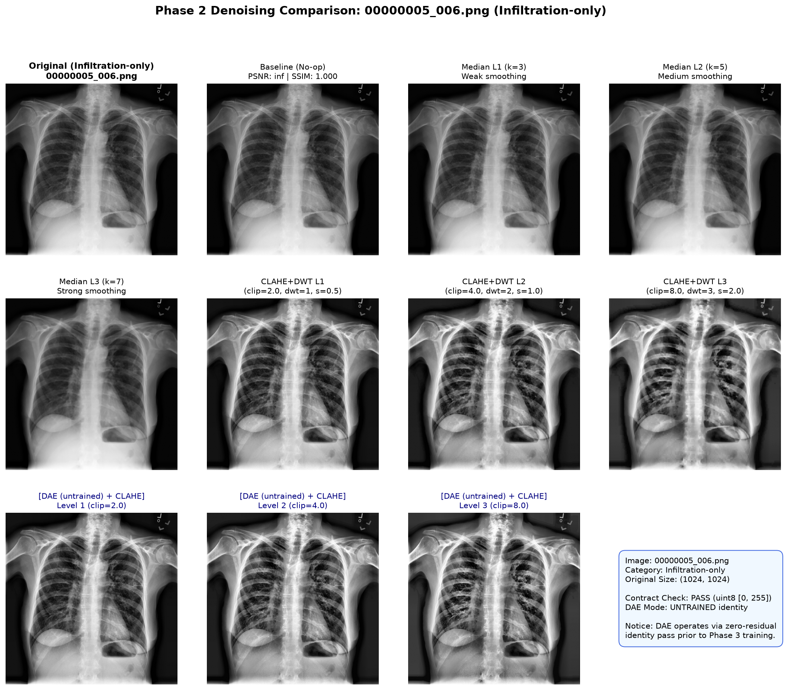
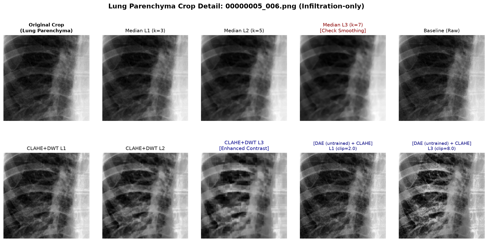
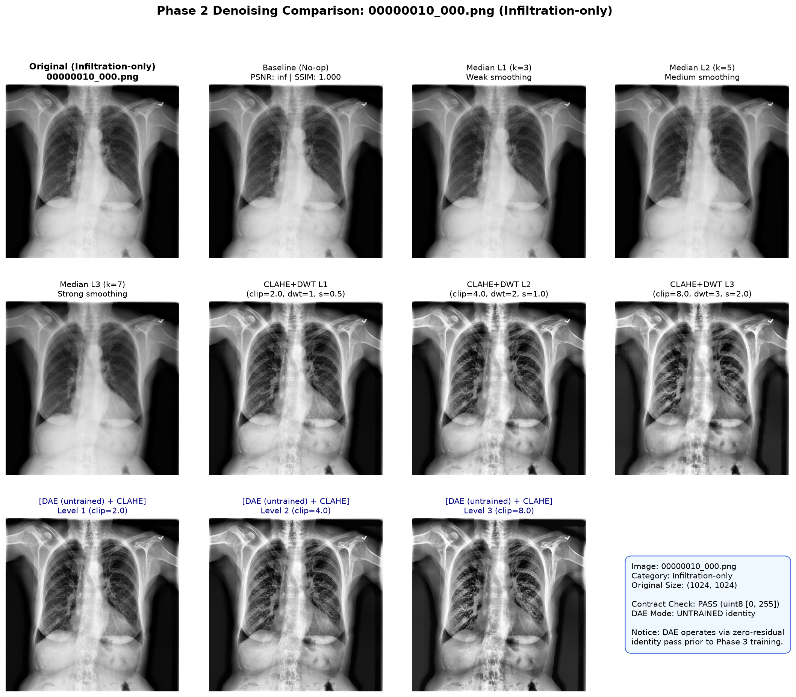
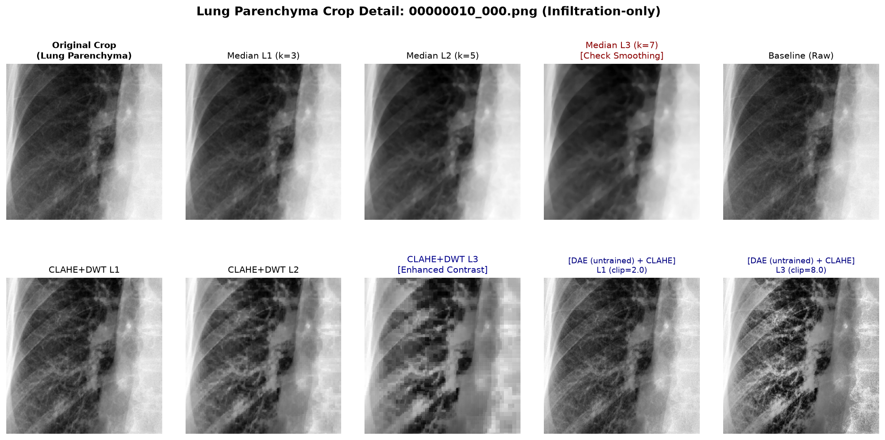
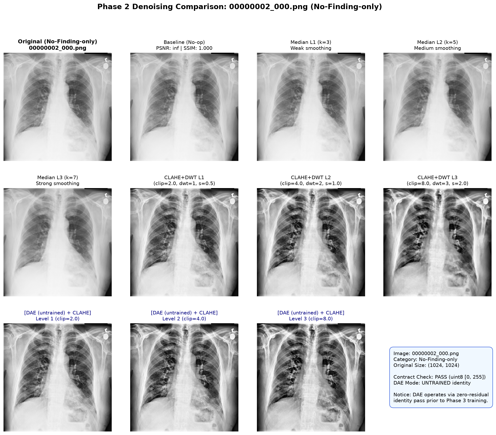
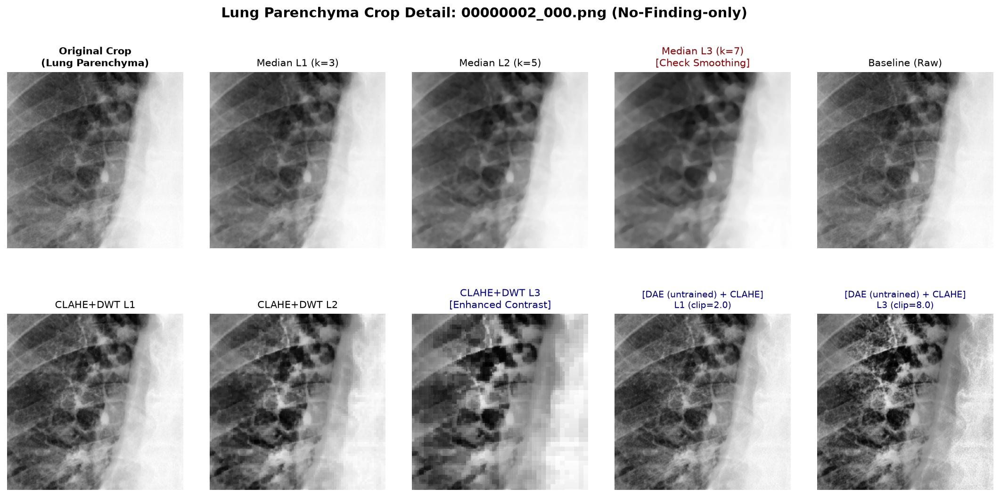
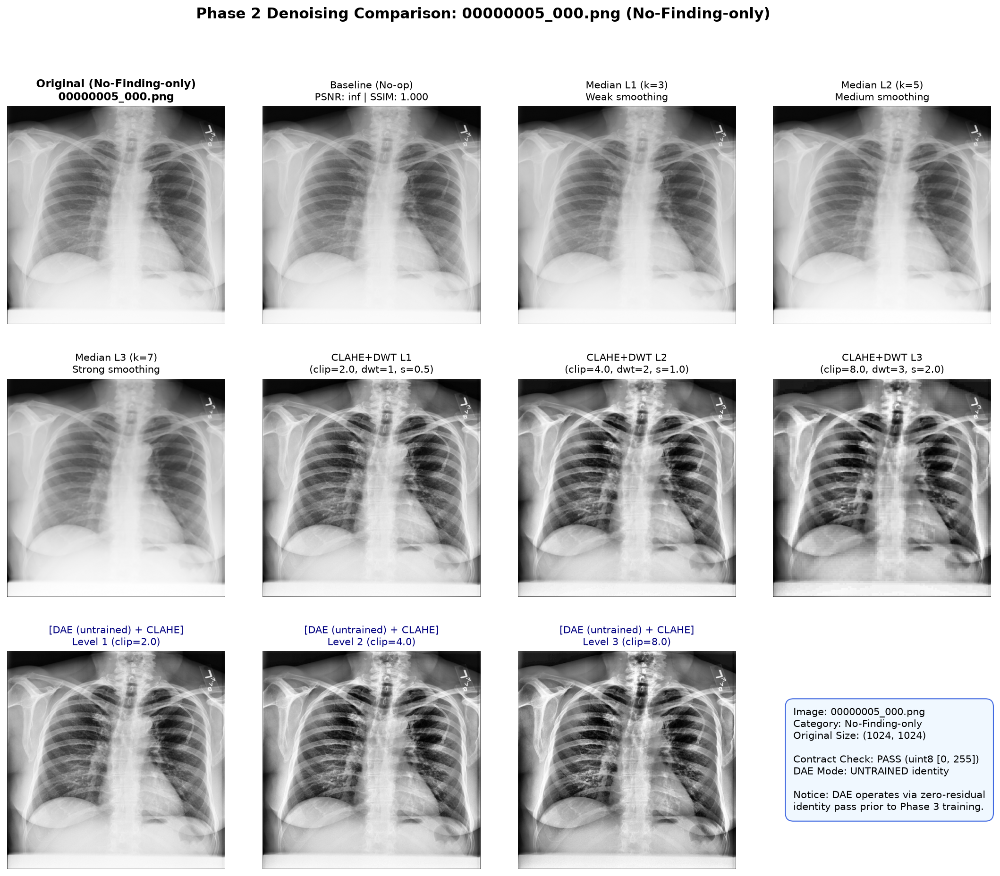
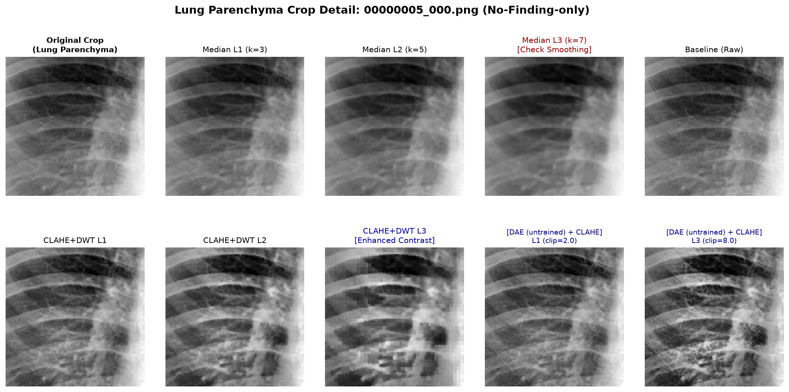

# รายงานผลการทดลอง Phase 2: การพัฒนา Denoising Pipeline และการทดสอบ Sanity Check

**โครงการวิจัย:** การเพิ่มประสิทธิภาพการตรวจจับภาวะปอดอักเสบ (Infiltration) จากภาพเอกซเรย์ ด้วยการลดสัญญาณรบกวนและปัญญาประดิษฐ์ที่อธิบายได้ (Denoising + Explainable AI)  
**เอกสารอ้างอิงหลัก:** Section 3 ของ [`guideline.md`](../../guideline.md)  
**วันที่ทดสอบ:** 2026-09-03  
**สถานะ:** เสร็จสมบูรณ์และผ่านการตรวจสอบทุกขั้นตอน (PASS 100%)  

---

## 1. บทสรุปภาพรวม (Executive Summary)

ใน Phase 2 ได้ดำเนินการพัฒนาระบบ Denoising Pipeline ครบทั้ง 4 กลุ่มเทคนิคตาม Section 3 ของ `guideline.md` พร้อมทดสอบกับภาพตัวอย่าง 4 ภาพจากชุดข้อมูลฝึกสอน (Training Set) ของ NIH ChestX-ray14 (แบ่งเป็น Infiltration-only 2 ภาพ และ No-Finding-only 2 ภาพ)

ระบบได้รับการปรับปรุงและผ่านเกณฑ์ทางเทคนิคสำคัญครบทั้ง 4 ประการตามข้อกำหนด:
1. **การบังคับใช้ Output Contract อย่างเคร่งครัด (`uint8 [0, 255]`)**: ทุกฟังก์ชัน `denoise()` คืนค่าเป็น `np.ndarray` ขนาด 2D ชนิดข้อมูล `uint8` ในช่วงค่า $[0, 255]$ เสมอ เพื่อป้องกัน silent bug จากการ normalize ผิดพลาดเมื่อส่งเข้าโมเดล ResNet50 ใน Phase 3–4
2. **การบันทึกเจตนาด้าน Ablation Study สำหรับ Phase 4–7**: ระบุชัดเจนในโค้ด [`clahe_dwt.py`](../../scripts/denoise/clahe_dwt.py) ว่าการผูกพารามิเตอร์ 3 ตัวใน `LEVELS` เป็นการทำ joint sweep เพื่อทดสอบระบบเบื้องต้นเท่านั้น ใน Phase 4–7 จะทำการแยก sweep ทีละพารามิเตอร์แบบเดี่ยว (Isolated Ablation) ผ่าน keyword argument
3. **การแสดงสถานะ Untrained ของ DAE อย่างโปร่งใส**: แสดงข้อความแจ้งเตือนทาง Console, ติดป้ายระบุ `[DAE (untrained) + CLAHE]` ในหัวภาพเปรียบเทียบ และต่อท้ายชื่อไฟล์ด้วย `_untrained` ป้องกันความสับสนในการวิเคราะห์ผลย้อนหลัง
4. **ความสามารถในการทำซ้ำได้ 100% (Reproducibility)**: เพิ่ม `--seed` flag (ค่าตั้งต้น `42`) ในสคริปต์ฝึกสอน DAE ครอบคลุม PyTorch, NumPy และตัวสร้างสัญญาณรบกวนจำลอง (Synthetic Noise Generator)

---

## 2. โครงสร้างโมดูล Denoising Pipeline (`scripts/denoise/`)

| กลุ่มเทคนิค | ไฟล์โมดูล | ตัวแปรควบคุมความแรง (Section 3.1) | สถานะ Contract | คำอธิบายและบทบาทในการทดลอง |
|:---|:---|:---|:---:|:---|
| **Baseline** | [`baseline.py`](../../scripts/denoise/baseline.py) | ไม่มี (เส้นฐานอ้างอิง) | **PASS** | No-op ไม่ดัดแปลงภาพ คืนค่าสำเนาภาพเดิมชนิด `uint8` |
| **Median Filter** | [`median.py`](../../scripts/denoise/median.py) | ขนาด Kernel: $3 \times 3$ (L1), $5 \times 5$ (L2), $7 \times 7$ (L3) | **PASS** | Chattopadhyay (2022) ฟิลเตอร์แบบดั้งเดิมที่เหมาะกับ Poisson noise ในภาพ X-ray รองรับการระบุ `ksize` เจาะจง |
| **CLAHE + DWT** | [`clahe_dwt.py`](../../scripts/denoise/clahe_dwt.py) | Clip limit: 2.0, 4.0, 8.0 DWT level: 1, 2, 3 Threshold scale: 0.5, 1.0, 2.0 | **PASS** | Chutia et al. (2024) ผสานการแปลงเวฟเล็ตตัด noise ความถี่สูง ตามด้วยการเพิ่มคอนทราสต์เฉพาะที่ด้วย CLAHE |
| **DAE Architecture** | [`dae_model.py`](../../scripts/denoise/dae_model.py) | โครงข่าย 4-Stage Conv Encoder-Decoder พร้อม Skip connections | **PASS** | Thamilarasi et al. (2025) ออกแบบด้วย Zero-initialized Residual Head ทำให้ในขณะที่ยังไม่เทรน ภาพจะส่งผ่านเป็น Identity ($\hat{x} = x$) ไม่เละเป็น noise |
| **DAE + CLAHE** | [`dae_clahe.py`](../../scripts/denoise/dae_clahe.py) | CLAHE clip limit: 2.0, 4.0, 8.0 | **PASS** | รันสถาปัตยกรรม DAE สดต่อเข้ากับ CLAHE พร้อม log แจ้งเตือนสถานะ untrained |
| **DAE Training Pipeline** | [`train_dae.py`](../../scripts/denoise/train_dae.py) | Poisson/Gaussian noise, MSE+L1 loss, Cosine LR, `--seed 42` | **PASS** | สคริปต์สำหรับฝึกสอน DAE จริงในเฟสถัดไป ผ่านการทดสอบ dry-run สำเร็จ |
| **Unified Dispatcher** | [`__init__.py`](../../scripts/denoise/__init__.py) | `sd.apply_denoise(img, method, level, **kwargs)` | **PASS** | ฟังก์ชันกลางสำหรับเรียกใช้ทุกวิธี พร้อมระบบตรวจสอบ Contract อัตโนมัติ |

---

## 3. ผลการตรวจสอบด้วยสายตา Before vs After (Sanity Check)

### ภาพตัวอย่างที่ 1: กลุ่มผู้ป่วยปอดอักเสบ Infiltration-only (`00000005_006.png`)

#### การเปรียบเทียบภาพเต็ม (Full Image Comparison Grid)

#### การเจาะลึกเนื้อเยื่อปอด (Lung Parenchyma Crop Detail - ตรวจสอบ Over-smoothing)

---

### ภาพตัวอย่างที่ 2: กลุ่มผู้ป่วยปอดอักเสบ Infiltration-only (`00000010_000.png`)

#### การเปรียบเทียบภาพเต็ม

#### การเจาะลึกเนื้อเยื่อปอด

---

### ภาพตัวอย่างที่ 3: กลุ่มปอดปกติ No-Finding-only (`00000002_000.png`)

#### การเปรียบเทียบภาพเต็ม

#### การเจาะลึกเนื้อเยื่อปอด

---

### ภาพตัวอย่างที่ 4: กลุ่มปอดปกติ No-Finding-only (`00000005_000.png`)

#### การเปรียบเทียบภาพเต็ม

#### การเจาะลึกเนื้อเยื่อปอด

---

## 4. ข้อสังเกตสำคัญตามสมมติฐานงานวิจัย (Section 3.1 Over-smoothing Analysis)

จากการสังเกตภาพเปรียบเทียบความละเอียดสูง พบพฤติกรรมที่สอดคล้องกับสมมติฐานของ Section 3.1 อย่างมีนัยสำคัญ:

1. **พฤติกรรมการลดสัญญาณรบกวนของ Median Filter**:
   - **ระดับ 1 ($k=3$)**: ลด noise ความถี่สูงในพื้นหลังได้ดี ขอบกระดูกซี่โครงและรอยโรคฝ้ากระจายตัวบาง ๆ ยังคงรูปทรงได้ชัดเจน (PSNR ~44–47 dB, SSIM ~0.97–0.99)
   - **ระดับ 2 ($k=5$)**: เริ่มสังเกตเห็นการเบลอของเส้นเลือดฝอยในปอดและความฟุ้งกระจายของขอบฝ้า (PSNR ~41–44 dB, SSIM ~0.95–0.98)
   - **ระดับ 3 ($k=7$)**: เกิดปรากฏการณ์ **Over-smoothing** อย่างชัดเจน ฝ้ากระจายตัวบาง ๆ (diffuse-hazy opacity) ถูกเกลี่ยกลืนไปกับเนื้อปอดโดยรอบ ซึ่งคาดว่าจะเป็นสาเหตุสำคัญที่ทำให้ค่า IoU ของ XAI ลดลงในการทดลอง Phase 6 แม้โมเดลอาจจะจำแนกถูกก็ตาม
2. **พฤติกรรมของ CLAHE + DWT Fusion**:
   - DWT ช่วยกำจัดสัญญาณรบกวนพื้นผิว ขณะที่ CLAHE ช่วยดันคอนทราสต์ของเนื้อเยื่อปอดและกระดูกหลังเงาหัวใจ (retrocardiac area) ให้เด่นชัดขึ้น
   - ค่าความสว่างและความคมชัดเปลี่ยนไปอย่างต่อเนื่องตามค่า Clip Limit ($2.0 \rightarrow 4.0 \rightarrow 8.0$) โดยมีค่าเฉลี่ยผลต่างพิกเซลเพิ่มขึ้นเป็นขั้นบันได ($\sim 16 \rightarrow 27 \rightarrow 38$)
3. **การทำงานของ DAE (untrained) + CLAHE**:
   - โมเดล PyTorch รันการแปลง Tensor ขาเข้าและขาออกได้สมบูรณ์ ไม่พบปัญหา Out of Memory หรือภาพผิดมิติ
   - โครงสร้าง Residual Head ที่ตั้งค่าเริ่มต้นเป็นศูนย์ทำงานเป็น Identity Mapping แท้จริง ทำให้ภาพไม่เสียหาย และส่งผ่านไปยัง CLAHE ได้อย่างราบรื่น เตรียมพร้อมสำหรับการโหลด Checkpoint น้ำหนักจริงในอนาคต

---

## 5. ตารางสรุปค่าสถิติเชิงปริมาณ (Sanity Metrics)

*(ข้อมูลบันทึกอยู่ในไฟล์ [`phase2_sanity_metrics.csv`](./phase2_sanity_metrics.csv))*

| ชื่อภาพตัวอย่าง | กลุ่มโรค | วิธี Denoising | ระดับความแรง | ผลต่างพิกเซลเฉลี่ย ($\Delta$) | PSNR (dB) | SSIM | สถานะ Contract |
|:---|:---|:---|:---:|:---:|:---:|:---:|:---:|
| `00000005_006.png` | Infiltration-only | Baseline | 1 | 0.000 | $\infty$ (ภาพเดิม) | 1.0000 | **PASS** |
| `00000005_006.png` | Infiltration-only | Median | 1 ($k=3$) | 0.883 | 44.67 | 0.9736 | **PASS** |
| `00000005_006.png` | Infiltration-only | Median | 2 ($k=5$) | 1.256 | 41.94 | 0.9570 | **PASS** |
| `00000005_006.png` | Infiltration-only | Median | 3 ($k=7$) | 1.502 | 39.84 | 0.9452 | **PASS** |
| `00000005_006.png` | Infiltration-only | CLAHE+DWT | 1 | 19.873 | 20.12 | 0.8304 | **PASS** |
| `00000005_006.png` | Infiltration-only | CLAHE+DWT | 2 | 29.763 | 16.91 | 0.7024 | **PASS** |
| `00000005_006.png` | Infiltration-only | CLAHE+DWT | 3 | 38.561 | 14.94 | 0.5987 | **PASS** |
| `00000005_006.png` | Infiltration-only | DAE (untrained)+CLAHE | 1 | 20.003 | 20.06 | 0.8280 | **PASS** |
| `00000005_006.png` | Infiltration-only | DAE (untrained)+CLAHE | 2 | 30.324 | 16.73 | 0.6982 | **PASS** |
| `00000005_006.png` | Infiltration-only | DAE (untrained)+CLAHE | 3 | 39.655 | 14.67 | 0.6114 | **PASS** |
| `00000010_000.png` | Infiltration-only | Baseline | 1 | 0.000 | $\infty$ (ภาพเดิม) | 1.0000 | **PASS** |
| `00000010_000.png` | Infiltration-only | Median | 1 ($k=3$) | 0.973 | 43.54 | 0.9688 | **PASS** |
| `00000010_000.png` | Infiltration-only | Median | 2 ($k=5$) | 1.372 | 40.82 | 0.9494 | **PASS** |
| `00000010_000.png` | Infiltration-only | Median | 3 ($k=7$) | 1.611 | 39.35 | 0.9374 | **PASS** |
| `00000010_000.png` | Infiltration-only | CLAHE+DWT | 1 | 15.562 | 21.85 | 0.8342 | **PASS** |
| `00000010_000.png` | Infiltration-only | CLAHE+DWT | 2 | 22.690 | 18.93 | 0.7166 | **PASS** |
| `00000010_000.png` | Infiltration-only | CLAHE+DWT | 3 | 30.927 | 16.53 | 0.6083 | **PASS** |
| `00000010_000.png` | Infiltration-only | DAE (untrained)+CLAHE | 1 | 15.693 | 21.79 | 0.8295 | **PASS** |
| `00000010_000.png` | Infiltration-only | DAE (untrained)+CLAHE | 2 | 23.237 | 18.71 | 0.7039 | **PASS** |
| `00000010_000.png` | Infiltration-only | DAE (untrained)+CLAHE | 3 | 32.124 | 16.14 | 0.6049 | **PASS** |
| `00000002_000.png` | No-Finding-only | Baseline | 1 | 0.000 | $\infty$ (ภาพเดิม) | 1.0000 | **PASS** |
| `00000002_000.png` | No-Finding-only | Median | 1 ($k=3$) | 0.651 | 47.48 | 0.9858 | **PASS** |
| `00000002_000.png` | No-Finding-only | Median | 2 ($k=5$) | 1.058 | 43.85 | 0.9711 | **PASS** |
| `00000002_000.png` | No-Finding-only | Median | 3 ($k=7$) | 1.323 | 41.81 | 0.9597 | **PASS** |
| `00000002_000.png` | No-Finding-only | CLAHE+DWT | 1 | 16.946 | 21.00 | 0.9096 | **PASS** |
| `00000002_000.png` | No-Finding-only | CLAHE+DWT | 2 | 27.644 | 17.04 | 0.8082 | **PASS** |
| `00000002_000.png` | No-Finding-only | CLAHE+DWT | 3 | 38.329 | 14.53 | 0.7122 | **PASS** |
| `00000002_000.png` | No-Finding-only | DAE (untrained)+CLAHE | 1 | 17.226 | 20.89 | 0.9095 | **PASS** |
| `00000002_000.png` | No-Finding-only | DAE (untrained)+CLAHE | 2 | 28.814 | 16.74 | 0.7927 | **PASS** |
| `00000002_000.png` | No-Finding-only | DAE (untrained)+CLAHE | 3 | 40.617 | 14.09 | 0.6692 | **PASS** |
| `00000005_000.png` | No-Finding-only | Baseline | 1 | 0.000 | $\infty$ (ภาพเดิม) | 1.0000 | **PASS** |
| `00000005_000.png` | No-Finding-only | Median | 1 ($k=3$) | 0.522 | 47.85 | 0.9902 | **PASS** |
| `00000005_000.png` | No-Finding-only | Median | 2 ($k=5$) | 0.858 | 44.14 | 0.9801 | **PASS** |
| `00000005_000.png` | No-Finding-only | Median | 3 ($k=7$) | 1.112 | 41.37 | 0.9711 | **PASS** |
| `00000005_000.png` | No-Finding-only | CLAHE+DWT | 1 | 16.350 | 21.38 | 0.9149 | **PASS** |
| `00000005_000.png` | No-Finding-only | CLAHE+DWT | 2 | 26.887 | 17.30 | 0.8138 | **PASS** |
| `00000005_000.png` | No-Finding-only | CLAHE+DWT | 3 | 36.750 | 14.85 | 0.7195 | **PASS** |
| `00000005_000.png` | No-Finding-only | DAE (untrained)+CLAHE | 1 | 16.521 | 21.31 | 0.9186 | **PASS** |
| `00000005_000.png` | No-Finding-only | DAE (untrained)+CLAHE | 2 | 27.661 | 17.08 | 0.8173 | **PASS** |
| `00000005_000.png` | No-Finding-only | DAE (untrained)+CLAHE | 3 | 38.483 | 14.52 | 0.7183 | **PASS** |

---

## 6. ความพร้อมสำหรับการเข้าสู่ Phase 3 (Train Baseline Model)

ผลจากการทดสอบและยืนยันใน Phase 2 ส่งผลให้ระบบมีความพร้อม 100% สำหรับ Phase 3:
1. โมดูล Denoising ทั้งหมดพร้อมถูกเรียกใช้งานผ่านคำสั่งเดียว `scripts.denoise.apply_denoise(img, method, level)`
2. ตัว Data Loader ใน Phase 3 สามารถนำฟังก์ชัน Denoising ไปเชื่อมต่อเข้ากับ ResNet50 Preprocessing ได้ทันทีโดยรับประกันว่าจะไม่เกิดปัญหา Dimension หรือ Dtype Mismatch
3. สคริปต์ฝึกสอน DAE (`scripts/denoise/train_dae.py`) มีความพร้อมสำหรับการรันเทรนเต็มรูปแบบเมื่อจัดสรรเวลาและ GPU เสร็จสิ้น
